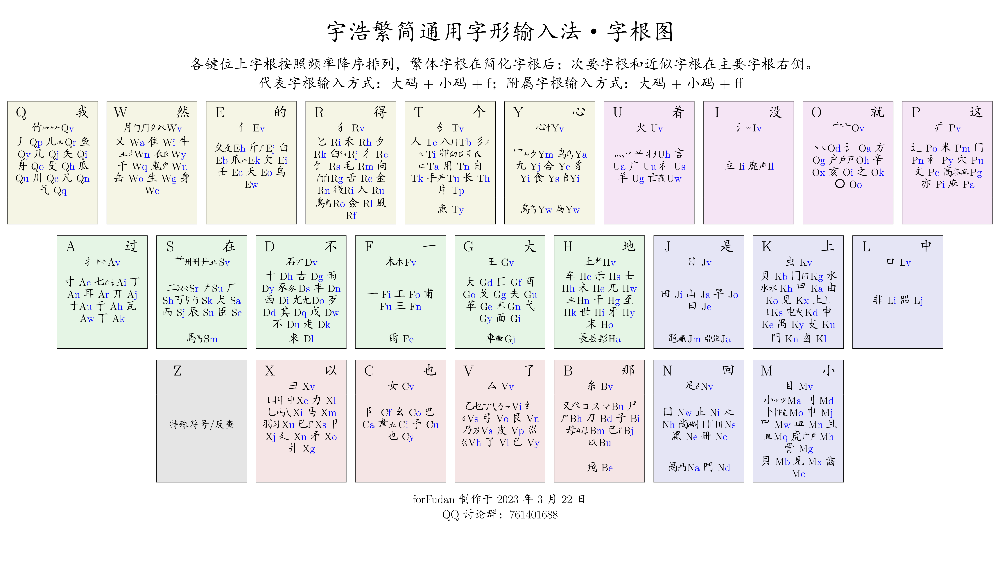

<!-- omit in toc -->
# 宇浩繁简通用字形输入法·全汉字覆盖·三重拆分注解

朱宇浩 创作于 荷兰鹿特丹

官方QQ群: 735728797

[在线拆分查询系统。](https://zhuyuhao.com/yuhao/chaifen)

- [1. 简介](#1-简介)
- [2. 下载和安装](#2-下载和安装)
  - [2.1. 百度和搜狗手机输入法 App](#21-百度和搜狗手机输入法-app)
  - [2.2. 落格输入法](#22-落格输入法)
  - [2.3. 小小输入法](#23-小小输入法)
  - [2.4. RIME 平台](#24-rime-平台)
    - [2.4.1. Windows / Macos / 安卓 / iOS 安装方法](#241-windows--macos--安卓--ios-安装方法)
    - [2.4.2. 具体文件介绍](#242-具体文件介绍)
  - [2.5. 方案特点](#25-方案特点)
    - [2.5.1. 提示快捷键](#251-提示快捷键)
    - [2.5.2. 单字拆分三重注解](#252-单字拆分三重注解)
    - [2.5.3. 增广常用字符集](#253-增广常用字符集)
    - [2.5.4. 一键切换字符集](#254-一键切换字符集)
    - [2.5.5. 使用 Z 键引导拼音反查](#255-使用-z-键引导拼音反查)
    - [2.5.6. 使用 Z 煞尾键输入特殊符号](#256-使用-z-煞尾键输入特殊符号)
    - [2.5.7. 全码词语屏蔽](#257-全码词语屏蔽)
  - [2.6. 纯净码表](#26-纯净码表)
- [3. 输入法规则介绍](#3-输入法规则介绍)
  - [3.1. 字根编码](#31-字根编码)
  - [3.2. 单字编码规则](#32-单字编码规则)
  - [3.3. 简码字](#33-简码字)
  - [3.4. 词语编码](#34-词语编码)
  - [3.5. 拆字规则](#35-拆字规则)
- [4. 更新日志](#4-更新日志)

## 1. 简介

使用「徐码」和繁体字写了一百万字的古典章回体小说后，我感到感到徐码区分主副根和回头码的特点有时候会带来思维上的负担，打字还不是特别流畅。基于市面上允许繁简通打的四码定长的方案只有徐码，所以我决定暂时放下小说创作，使用Python制作一款更加适合繁体、简体、繁简混合三种模式下进行文学创作的方案。特别的，我希望它能够做到规则简明、常用繁简字闭眼盲打、大字集检字方便。经过了一系列调试和改进，在同好们的支持和鼓励下，这款输入法终于大功告成。我给他取名叫「宇浩」，因为汉字博大精深，如宇宙浩大。但使用这款输入法，可以轻松打出九万多个汉字。这款输入法具有以下特点：

- 面向大字集，全面覆盖CJK全字集98000多个汉字和部首。
- 大陆和台湾的繁简常用字重码率很低。可以闭上眼睛，不用选​字，流畅地进行写作。
- 按顺序拆字，取一、二、三、末字根，思维负担较轻。
- 双编码，不分主副根，没有结构码。全简一致。规则简单。
- 字根大码的排布按照键盘分区，字根小码使用拼音中的字母，便于上手。
- 只使用25键，不使用Z键，手感好。中排、上排按键频率都超过40%。最高频的汉字一级简码位于最容易按的键上：`E的`、`F一`、`V了`、`I没`。
- 线性的学习体验，[教程详尽。](https://zhuyuhao.com/yuhao/learn)在简快码的加持下，只用记住50个字根，就能基本输入最常用的500个汉字，其他字根可以边打边学。

这里对比一下五笔、郑码、徐码、虎码在不同汉字字符集下的单字全码的重码数量，以供参考。这些都是我比较喜欢、有亮点的输入法。仓颉虽然是五码定长，但它在繁体输入上地位很高，所以也将它纳入比较。加粗的数字代表本行最优值。排名按发明时间顺序：

| 形碼方案   |  GB2312 | 國字常用 | 常用繁簡 |      GBK | 簡體選重率 | 繁簡選重率 |
| :--------- | ------: | -------: | -------: | -------: | ---------: | ---------: |
| 倉頡(五代) |     422 |      164 |      606 | **2893** |      0.89% |      0.83% |
| 五筆(86)   |     537 |      357 |     1718 |     6582 |      0.34% |      2.74% |
| 五筆(98)   |     515 |      329 |     1656 |     6368 |      0.38% |      2.77% |
| 鄭碼       |     563 |      311 |     1784 |     6590 |      0.60% |      2.92% |
| 徐碼       |     318 |  **127** |  **480** |     2902 |      0.11% |  **0.15%** |
| 虎碼       |     532 |      238 |     2049 |     7687 |  **0.06%** |      4.00% |
| 宇浩       | **305** |      218 |      608 |     4968 |  **0.06%** |  **0.15%** |

## 2. 下载和安装

本方案可以在任何手机或电脑的输入法 App 上使用，比如百度、搜狗、落格、小小等。以下逐一进行介绍。

### 2.1. 百度和搜狗手机输入法 App

安装方法如下：

- 将 [/mabiao](https://github.com/forFudan/yuhao/tree/main/mabiao/baidu/) 文件夹下的**yuhao.txt**下载到设备上。
- 进入输入法程序，在设置中选择导入自定义码表。
- 将**yuhao.txt**导入后即可直接使用。

比如，百度输入法 iOS 版：

- 点击「我的」
- 点击右上方设置按钮
- 点击「输入设置」
- 点击「五笔输入」
- 点击「自定义方案」
- 点击「导入方案」
- 选择下载的**yuhao.txt**文件，导入后即可使用。

### 2.2. 落格输入法

安装方法如下：

- 将 [/mabiao](https://github.com/forFudan/yuhao/tree/main/mabiao/luoge/) 文件夹下的**yuhao.txt**下载到设备上。
- 进入输入法程序，在设置中选择导入自定义码表。
- 将**yuhao.txt**导入后即可直接使用。

### 2.3. 小小输入法

小小输入法码表是[/mabiao](https://github.com/forFudan/yuhao/tree/main/mabiao/yong/) 文件夹下的**yuhao.txt**。

### 2.4. RIME 平台

下面介绍的是挂载于[RIME平台（小狼毫、鼠须管）](https://rime.im/)的方案。我对它进行了深度定制，具有以下特点：

- 提供至CJK-H区、兼容区、部首区超过98000个汉字的完整拆分、编码提示、字集提示。
- 支持二级简码快速标点符号输入。
- 支持自定义字符集过滤生僻字。常用字约一万字，包括GB2312汉字、國語常用字、其它常用汉字等。支持用户自定义修改。
- 提供四码只出单字功能，适合单字派。

#### 2.4.1. Windows / Macos / 安卓 / iOS 安装方法

在安装了 Rime（小狼毫、鼠须管、同文、iRime）后，将 [/schema](https://github.com/forFudan/yuhao/tree/main/schema) 文件夹下的**所有文件**复制到 Rime 目录下。同时在 default.custom.yaml 文件中加入以下内容：

```yaml
patch:
  schema_list:
    - schema: yuhao
    - schema: yuhao_starter
```

点击「部署」之后即可使用。

#### 2.4.2. 具体文件介绍

文件介绍：

- yuhao.schema.yaml 给熟手的方案文件，默认关闭拆分提示、常用字优先、关闭预测、显示五个候选项，横排。
- yuhao_starter.schema.yaml 给新手使用的方案文件，默认打开拆分提示、屏蔽生僻字、开启预测、显示9个候选项。
- yuhao.dict.yaml 字典文件
- rime.lua 脚本设定
- lua/yuhao/... 各种脚本
- opencc/... 单字拆分表
- pinyin_simp.schema.yaml 袖珍简化字拼音配置文件
- pinyin_simp.dict.yaml 袖珍简化字拼音字典文件

### 2.5. 方案特点

#### 2.5.1. 提示快捷键

输入`help`或`zzzz`或`bang`可显示快捷键提示。

#### 2.5.2. 单字拆分三重注解

提供至CJK-H区、兼容区、部首区超过98000个汉字的拆分、编码提示、字集提示。拆分提示中包括三重注解：

1. 该汉字的拆分。
2. 该汉字的全码。使用大小写字母区分大小码。
3. 该汉字所在的字符集（GB2312，GBK，CJK，CJK A 到 H 区，兼容字等）。

用户还可通过「Shift+Ctrl+C」切换拆分状态。

#### 2.5.3. 增广常用字符集

本方案使用了自定的常用字符，将常用字一网打尽，避免了 RIME 内置字符集「GB2312字太少，GBK字太多」的问题。包括了以下一万个左右的字符：

- 《通用规范汉字表》中定义的，在 GB2312 字集内的汉字
- 台湾的「国字常用字」
- 286个大陆繁体字形
- 注音符号
- 「〇」符号

#### 2.5.4. 一键切换字符集

在输入过程中，用户可选择两种切换字集的方式：

- 通过「Shift+Ctrl+O」在常用字符集和CJK大字符集之间进行切换（过滤）。
- 通过「Shift+Ctrl+I」将常用字符集优先显示（优先）。

用户还可通过「Shift+Ctrl+F」进行简入繁出输入。

#### 2.5.5. 使用 Z 键引导拼音反查

按下 Z 键，可以随时使用拼音输入词语，并实现反查。袖珍简化字拼音：<https://github.com/rime/rime-pinyin-simp>

#### 2.5.6. 使用 Z 煞尾键输入特殊符号

本方案输入特殊符号，包括标点符号、注音符号、日语假名（训令罗马字）等。只要在编码结束后加`z`即可，比如：

- 分号：`fhz`
- 注音符号 ㄤ：`angz`

#### 2.5.7. 全码词语屏蔽

一键屏蔽四码词语，同时保留简码词。热键为「Shift+Ctrl+D」。适合保留简码词的全码单字派。

### 2.6. 纯净码表

纯净码表只包含单字全码，适合高手字形配置简码和词库。文件为[/mabiao](https://github.com/forFudan/yuhao/tree/main/mabiao/purity/) 文件夹下的**yuhao.txt**。

## 3. 输入法规则介绍

这一章，我会对宇浩输入法的基本规则进行简单介绍。如果你从未接触过字形输入法，可以从头开始一步一步学习。[点击此处阅读详细的《宇浩繁简通打输入法教程》。](https://zhuyuhao.com/yuhao/learn)

输入法有优点就有缺点，但我努力做到扬长避短。这里总结一下「宇浩输入法」对若干痛点的解决方法是：

- 宇浩输入法使用了和五笔一样的分键盘区域随机排布字根的方式。横区在键盘中排左侧，竖区在键盘中下排右侧，撇区在键盘上排左侧，捺区在键盘上排右侧，折区在键盘下排左侧。字根较为随机，这个考量是为了降重，同时不增加规则的复杂度。实际使用的时候，字根可以短时间内熟练，但规则的复杂度带来的痛苦是长久的。分区域分布，这是为了降低使用者上手的困难度。
- 宇浩输入法部分借鉴了徐码的首根小码后置（回头码）的特点，但徐码的副根字无论在任何情况下都要回头，这等同于在输入单字的时候一直判断取三根还是四根，容易出错。宇浩输入法只有在编码不足四码（双根字）的情况下才需要补上首根小码。
- 宇浩输入法使用了和五笔一样取一二三末根。而不是郑码和徐码那样，有时候取一、二、次末、末，有时候取一二末。这样选择，是因为倒数第二根的判断比较困难，打字的时候容易卡壳。

[点击此处详细了解我对一款具有平衡性的输入法的一些思考和分析，以及宇浩输入法的设计理念和基本考量。](https://zhuyuhao.com/yuhao/discussion)

### 3.1. 字根编码

「宇浩」使用双编码字根，即每一个字根对应两个字母。第一个字母叫做**大码**，第二个字母叫做**小码**。

字根大码，是按照字根第一笔的笔画来制定的。「宇浩」同五笔一样，字根按照笔画分区。

- ASDFGH 包含了首笔为「横」的字根，例如：`A寸` `F一`等。横区在键盘中排左侧。
- JKLNM 包含了首笔为「竖」的字根，例如：`J日` `K上`等。竖区在键盘中下排右侧。
- QWERTY 包含了首笔为「撇」的字根，例如：`P竹` `T人`等。撇区在键盘上排左侧。
- UIOP 包含了首笔为「捺」和「点」的字根，例如：`U言` `I立`等。捺区在键盘上排右侧。
- BVCX 包含了首笔为「折」的字根，例如：`B刀` `C巴`等。折区在键盘下排左侧。
- Z 键没有字根，可以用来反查拼音或做其他用途。

字根的小码，都是尽量从它汉语拼音包含的字母中随机选取。如果拼音中有`Z`或`X`，那么可以选`K`来代替。

我注意到，最常用的100个字根，占了85%的使用频率！按照频率降序，它们是：

```
口艹一木月日丷氵人又土扌八亻二冖丶心十丿大夂乙亠竹钅女匕厶贝石宀虫冂小王纟阝尸讠火田彐乂辶儿山米目屮寸禾刂卜力工隹疒丨足立匚巾子彡囗七广斤𠂇车夕鱼刀止牛犭厂白戈水弓乚爪丁夫𧘇鸟门古耳酉罒方马皿几〢示卯
```

所以，在学习的时候，请**务必**按照上面的次序记忆字根，而不是一股脑地背诵全部。先练熟*边际收益*高的字根，会显著加快上手打字的进程，增加学习乐趣和成就感。而偏僻的字根，可以等未来慢慢熟悉。字根图如下：



### 3.2. 单字编码规则

宇浩输入法的单字编码取一、二、三、末根。这同五笔输入法相同，和郑码、徐码不同。单字编码规则如下：

1. 依次取一、二、三、末根大码。
2. 不足四码时，补上末根小码。
3. 仍然不足四码时，补上首根小码（如果小码是v则不用补）。

字根字直接输入大小码加`f`出字。

### 3.3. 简码字

从A到Y排列，一级简码字分别是`过那也不的一大地没是上中小回就这我得在个着了然出`。

宇浩的字根设计，使得最高频的汉字分布在最容易按的键上，比如：「的」在`E`上，「一」在`F`上，「了」在`V`上，「没」在`I`上，「不」在`D`上，「上」在`K`上。

二级简码字共625个，是该字全码的前两个字母。宇浩输入法**全简一致**。

### 3.4. 词语编码

宇浩输入法**字词编码一致**。规则如下：

- 两字词，取每个字**全码**的前两码即可。
- 三字词，取前两字的第一码，和第三个字的前两码即可。
- 四字词及以上，取前三字的第一码，和最后一个字的第一码即可。

### 3.5. 拆字规则

「宇浩」拆字规则的按优先级排序如下：

1. 字根数量能少不多
2. 符合笔顺笔顺优先
3. 能散就不连
4. 能连就不交
5. 能交就不断
6. 拆分尽量美观
7. 前根笔画尽量多

## 4. 更新日志

[点此查看更新日志。](./updates.md)
