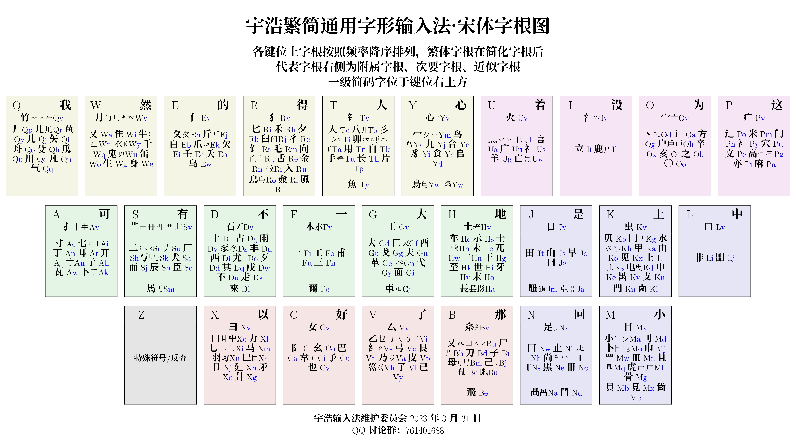

<!-- omit in toc -->
# 宇浩输入法·繁簡通打混输·全汉字覆盖

朱宇浩 创作 | 官方QQ群: 735728797

[详细教程](https://zhuyuhao.com/yuhao/learn) | [在线拆分查询](https://zhuyuhao.com/yuhao/chaifen) | [更新日志](https://zhuyuhao.com/yuhao/updates)

[在线字根练习](https://zhuyuhao.com/yuhao/practice) | [最常用100字根练习](https://zhuyuhao.com/yuhao/practice_100) | [最常用50字根练习](https://zhuyuhao.com/yuhao/practice_50)

```txt
站在巨人的肩膀上，专为文学创作而设计。
宇浩愿你如写字一般打字，忽略输入框，闭眼享受创作的乐趣。
自由书写繁简汉字，在现代文、文言文之间随心徜徉。
```

- [1. 简介](#1-简介)
- [2. 十分钟入门宇浩输入法](#2-十分钟入门宇浩输入法)
  - [2.1. 汉字拼图](#21-汉字拼图)
  - [2.2. 字根编码](#22-字根编码)
  - [2.3. 单字编码规则](#23-单字编码规则)
  - [2.4. 简码字](#24-简码字)
  - [2.5. 词语编码](#25-词语编码)
- [3. 下载和安装](#3-下载和安装)
  - [3.1. 百度手机输入法 （简单、快捷，推荐使用）](#31-百度手机输入法-简单快捷推荐使用)
  - [3.2. 落格输入法](#32-落格输入法)
  - [3.3. 小小输入法](#33-小小输入法)
  - [3.4. RIME 输入法](#34-rime-输入法)
  - [3.5. 纯净码表](#35-纯净码表)
- [4. RIME版特点](#4-rime版特点)

## 1. 简介

使用繁体字写了一百万字的古典章回体小说后，我感到感到徐码区分主副根和回头码的特点有时候会带来思维上的负担，打字还不是特别流畅。基于市面上允许**繁简通打**的**四码定长**的方案只有徐码，所以我决定暂时放下小说创作，使用Python制作一款更加适合繁体、简体、繁简混合三种模式下进行文学创作的方案。特别的，我希望它能够做到规则简明、常用繁简字闭眼盲打、大字集检字方便。经过了一系列调试和改进，在同好们的支持和鼓励下，这款输入法终于大功告成。我给他取名叫「宇浩」，因为汉字博大精深，如宇宙浩大。但使用这款输入法，可以轻松打出九万多个汉字。这款输入法具有以下特点：

- 面向大字集，全面覆盖CJK全字集98000多个汉字和部首。
- 大陆和台湾的繁简常用字重码率很低。可以闭上眼睛，不用选​字，流畅地进行写作。
- 按顺序拆字，取一、二、三、末字根，思维负担较轻。
- 采用大字根，拆法更直观。相较于小字根输入法，不会汉字拆得零碎。
- 双编码，不分主副根，没有结构码。全简一致。规则简单。
- 字根大码的排布按照键盘分区，字根小码使用拼音中的字母，便于上手。
- 只使用25键，不使用Z键，手感好。中排、上排按键频率都超过40%。最高频的汉字一级简码位于最容易按的键上：`E的`、`F一`、`V了`、`I没`。
- 线性的学习体验，[教程详尽。](https://zhuyuhao.com/yuhao/learn)在简快码的加持下，只用记住50个字根，就能基本输入最常用的500个汉字，其他字根可以边打边学。

这里对比一下五笔、郑码、徐码、虎码在不同汉字字符集下的单字全码的重码数量，以供参考（选重率指的是平均输入多少个汉字需要选一次重码字）。这些都是我比较喜欢、有亮点的输入法。仓颉虽然是五码定长，但它在繁体输入上地位很高，所以也将它纳入比较。加粗的数字代表本行最优值。排名按发明时间顺序：

| 形码方案 |  简体GB2312 | 国字常用 | 常用繁简 |      GBK | 简体选重率率 | 繁体选重率 | 繁简混合文本选重率 |
| :------- | ------: | -------: | -------: | -------: | ---------: | ---------: | ---------: |
| 郑码     |     563 |      311 |     1784 |     6590 |      0.60% |      0.63% |      2.40% |
| 五笔86   |     537 |      357 |     1718 |     6582 |      0.34% |      0.79% |      2.12% |
| 五笔98   |     515 |      329 |     1656 |     6368 |      0.38% |      0.78% |      2.16% |
| 徐码   |     318 |  **127** |  **480** |     2902 |      0.11% |      0.22% |      0.22% |
| 仓颉五代 |     422 |      164 |      606 | **2893** |      0.89% |      0.49% |      1.06% |
| 虎码     |     532 |      238 |     2049 |     7687 |      0.06% |      0.37% |      2.84% |
| 宇浩     | **303** |      216 |      606 |     4971 |  **0.05%** |  **0.17%** |  **0.21%** |

输入法有优点就有缺点，但我努力做到扬长避短。[点击此处详细了解我对一款具有平衡性的输入法的一些思考和分析，以及宇浩输入法的设计理念和基本考量。](https://zhuyuhao.com/yuhao/discussion)

## 2. 十分钟入门宇浩输入法

这一章，我会对宇浩输入法的基本规则进行简单介绍。如果你从未接触过字形输入法，可以从头开始一步一步学习。[点击此处阅读详细的《宇浩繁简通打输入法教程》。](https://zhuyuhao.com/yuhao/learn)

[在开始之前，你可以下载挂载于小小输入平台上的宇浩输入法](./assets/宇浩输入法-小小输入平台.exe)。打开 exe 文件后可以直接使用宇浩输入法打字。

### 2.1. 汉字拼图

汉字，区别于其他字母文字，有着高度的统一性。不管你使用哪一种方言，不管你会不会普通话，不管你知不知道这个字的读音，只要你把它写在纸上，就能同其他人进行交流（笔谈）。这是字形输入法的一大优势：不借助语音，而关注字的形态。你只要会写，就能将这个字输入到电脑中。宇浩输入法作为一款**字形输入法**，其设计的理念就是希望如同在纸上书写一般去打字，并适合各种文本的创作。当你脑海中想到的是方言时，你用拼音可能会卡壳，但用宇浩输入法就不会。

那么，宇浩输入法是怎样做到打字如写字的呢？

我们从小学习汉字的时候就知道，每一个汉字都是由基本笔画或部首组成的。将这些部首和笔画拼在一起，就组成了一个个汉字。宇浩输入法的本质，就是给每一个部首一个字母。当我们把部首对应的字母按顺序输入到电脑里后，汉字就出现了。在宇浩输入法中，这些构成汉字的基本部首或笔画，称为**字根**。

例如，「浩」这个汉字，就是由三个部分组成的：氵牛口。我们在输入的时候，只要依次输入这三个字根对应的字母，就可以输出这个汉字。

### 2.2. 字根编码

宇浩输入法的每一个字根（部首、笔画）都被安排了两个字母，这两个字母也就是这个字根的身份号码。其中，第一个字母叫做**大码**，比较重要。第二个字母叫做**小码**，重要性稍微低一些。

字根大码，是按照字根第一笔的笔画来制定的，并且按照键盘分区分布。

- ASDFGH 包含了首笔为「横」的字根，例如：`A寸` `F一`等。横区在键盘中排左侧。
- JKLNM 包含了首笔为「竖」的字根，例如：`J日` `K上`等。竖区在键盘中下排右侧。
- QWERTY 包含了首笔为「撇」的字根，例如：`P竹` `T人`等。撇区在键盘上排左侧。
- UIOP 包含了首笔为「捺」和「点」的字根，例如：`U言` `I立`等。捺区在键盘上排右侧。
- BVCX 包含了首笔为「折」的字根，例如：`B刀` `C巴`等。折区在键盘下排左侧。
- Z 键没有字根，可以用来反查拼音或做其他用途。

字根的小码，基本上是它汉语拼音的一个字母。如果拼音中有`Z`或`X`，那么可以选`K`来代替。

在汉字体系中，最常用的100个字根（部首、笔画），占了85%的使用频率！也就是说，当你知道这100个字根的编码（主要是大码）后，你就可以组合出85%的汉字来。按照频率降序，这些字根是：

```md
白月丶一了日龰不丿扌戈𠂇尚土人文辶亻也米冖小讠丷口儿上至刂宀尤羊目大门自刀二阝厶子丅凵寸手西女氵殳犬灬甲力彳丁心斤乚禾又木匕走己之而八生十身𬺰彐夕豕面矢艹王见艮卜夂纟工龶巴止舌已士尸立囗竹夭户戊乙方且
```

所以，在接下来的学习中，请**务必**按照上面的次序记忆字根，而不是一股脑地背诵全部。先练熟*边际收益*高的字根，会显著加快上手打字的进程，增加学习乐趣和成就感。而偏僻的字根，可以等未来慢慢熟悉。[使用字根练习页面来练习最常用的50个字根](./practice_50.html)，然后[继续练习最常用的100个字根](./practice_100.html)。

字根键位图如下：



为了方便记忆，我写了一首打油诗（字根口诀）：

```md
A 丁丌行右瓦，耳下打七寸。  S 草头二犬厂，辰考而有臣。
D 古來十石尤其戊，西雨不走歹豕丰，  F 一木甫三工。  
G 大王革春夫，框面弋酉戈。  H 老上青士示兀牙，末世土干未至车。
J 早日山曰田，  K 甲申由禺电，下框敲右边，重門兼繁鹵，虫贝水上见。
L 四口非口，  M 巾网貝皿且具上，小目立刀卜虎骨。
N 方框二三竖，黑册尚止足。
Q 荒下没右鱼儿气，撇川竹矢凡几舟。  W 周圍炙顶皆同月，千鬼上身生牛头，衣下杀上谁侧缶？
E 反文人欠斤，白爪壬乌夭。  R 双人饣匕入舌臼，犬向夕禾微金毛。
T 八人手长二三撇，金边自用介下卯。  Y 冪头心合豸，阜上食九鸟。
U 兰头将左四点火，赢框广衣言亡羊，  I 鹿头三点立水上。
O 辛亥之宝盖，言边户点方。  P 高门麻穴文亦米，病头走之衣字旁。
```

### 2.3. 单字编码规则

宇浩输入法的单字编码取一、二、三、末根。这同五笔输入法相同，和郑码、徐码不同。单字编码规则如下：

1. 依次取一、二、三、末根大码。
2. 不足四码时，补上末根小码。
3. 仍然不足四码时，补上首根小码（如果小码是v则不用补）。

字根字直接输入大小码加`f`出字。

### 2.4. 简码字

从A到Y排列，一级简码字分别是`把那好不的一大地没是上中小回为这我得有人着了然以`。

宇浩的字根设计，使得最高频的汉字分布在最容易按的键上，比如：「的」在`E`上，「一」在`F`上，「了」在`V`上，「没」在`I`上，「不」在`D`上，「上」在`K`上。

二级简码字共625个，是该字全码的前两个字母。宇浩输入法**全简一致**。

### 2.5. 词语编码

宇浩输入法**字词编码一致**。规则如下：

- 两字词，取每个字**全码**的前两码即可。
- 三字词，取前两字的第一码，和第三个字的前两码即可。
- 四字词及以上，取前三字的第一码，和最后一个字的第一码即可。

## 3. 下载和安装

本方案可以在任何手机或电脑的输入法 App 上使用，比如百度、搜狗、落格、小小等。以下逐一进行介绍。

### 3.1. 百度手机输入法 （简单、快捷，推荐使用）

安装方法如下：

- 将 [/mabiao](https://github.com/forFudan/yuhao/tree/main/mabiao/baidu/) 文件夹下的**yuhao.txt**下载到设备上。
- 进入输入法程序，在设置中选择导入自定义码表。
- 将**yuhao.txt**导入后即可直接使用。

比如，百度输入法 iOS 版：

- 点击「我的」
- 点击右上方设置按钮
- 点击「输入设置」
- 点击「五笔输入」
- 点击「自定义方案」
- 点击「导入方案」
- 选择下载的**yuhao.txt**文件，导入后即可使用。

搜狗手机输入法类似。

### 3.2. 落格输入法

安装方法如下：

- 将 [/mabiao](https://github.com/forFudan/yuhao/tree/main/mabiao/luoge/) 文件夹下的**yuhao.txt**下载到设备上。
- 进入输入法程序，在设置中选择导入自定义码表。
- 将**yuhao.txt**导入后即可直接使用。

### 3.3. 小小输入法

小小输入法码表是[/mabiao](https://github.com/forFudan/yuhao/tree/main/mabiao/yong/) 文件夹下的**yuhao.txt**。

### 3.4. RIME 输入法

下面介绍的是挂载于[RIME平台（小狼毫、鼠须管、同文、iRime）](https://rime.im/)的方案。我对它进行了深度定制，具有以下特点：

- 提供至CJK-H区、兼容区、部首区超过98000个汉字的完整拆分、编码提示、字集提示。
- 支持二级简码快速标点符号输入。
- 支持自定义字符集过滤生僻字。常用字约一万字，包括GB2312汉字、國語常用字、其它常用汉字等。支持用户自定义修改。
- 提供四码只出单字功能，适合单字派。

在安装了 Rime（小狼毫、鼠须管、同文、iRime）后，将 [/schema](https://github.com/forFudan/yuhao/tree/main/schema) 文件夹下的**所有文件**复制到**用户文件夹**下（可以右击 Rime 图标后点击「用户文件夹」来打开）。点击「部署」之后即可使用。

方案文件介绍：

- yuhao.schema.yaml 给熟手的方案，默认关闭拆分提示、常用字优先、关闭预测、横排显示5个候选项。
- yuhao_starter.schema.yaml 给新手使用的方案，默认打开拆分提示、屏蔽生僻字、开启预测、竖排显示9个候选项。
- yuhao_tradition.schema.yaml 传统汉字方案，默认关闭拆分提示、常用字优先、开启预测、横排显示5个候选项。
- yuhao.dict.yaml 字典文件
- yuhao_tradition.dict.yaml 传统汉字字典文件
- rime.lua 脚本设定
- lua/yuhao/... 各种脚本
- opencc/... 拆分表
- pinyin_simp.schema.yaml 袖珍简化字拼音配置文件
- pinyin_simp.dict.yaml 袖珍简化字拼音字典文件
- luna_pinyin.schema.yaml 朙月拼音配置文件
- luna_pinyin.dict.yaml 朙月拼音字典文件

RIME 版詳細功能見第四章。

### 3.5. 纯净码表

纯净码表只包含单字全码，适合高手字形配置简码和词库。文件为[/mabiao](https://github.com/forFudan/yuhao/tree/main/mabiao/purity/) 文件夹下的**yuhao.txt**。

## 4. RIME版特点

<!-- omit in toc -->
### 4.1. 提示快捷键

输入`help`或`zzzz`或`bang`可显示快捷键提示。

<!-- omit in toc -->
### 4.2. 单字拆分三重注解

提供至CJK-H区、兼容区、部首区超过98000个汉字的拆分、编码提示、字集提示。拆分提示中包括三重注解：

1. 该汉字的拆分。
2. 该汉字的全码。使用大小写字母区分大小码。
3. 该汉字所在的字符集（GB2312，GBK，CJK，CJK A 到 H 区，兼容字等）。

用户还可通过「Shift+Ctrl+C」切换拆分状态。

<!-- omit in toc -->
### 4.3. 增广常用字符集

本方案使用了自定的常用字符，将常用字一网打尽，避免了 RIME 内置字符集「GB2312字太少，GBK字太多」的问题。包括了以下一万个左右的字符：

- 《通用规范汉字表》中定义的，在 GB2312 字集内的汉字
- 台湾的「国字常用字」
- 286个大陆繁体字形
- 注音符号
- 「〇」符号

<!-- omit in toc -->
### 4.4. 一键切换字符集

在输入过程中，用户可选择两种切换字集的方式：

- 通过「Shift+Ctrl+O」在常用字符集和CJK大字符集之间进行切换（过滤）。
- 通过「Shift+Ctrl+I」将常用字符集优先显示（优先）。

用户还可通过「Shift+Ctrl+F」进行简入繁出输入。

<!-- omit in toc -->
### 4.5. 使用 Z 键引导拼音反查

按下 Z 键，可以随时使用拼音输入词语，并实现反查。

<!-- omit in toc -->
### 4.6. 使用 z 键作为通配符/学习符

除第一码外，可以使用z键代替其他编码，方便一下子忘记大小码的你继续输入。

<!-- omit in toc -->
### 4.7. 使用 z 键上屏历史输入

可以使用`z`键快速上屏最近的历史输入。

<!-- omit in toc -->
### 4.8. 输入特殊符号

本方案可以用编码输入特殊符号，包括标点符号、注音符号、日语假名（训令罗马字）等。只要输入引导符号：

- `fh`引导注音符号。例如：ㄤ，`fhan`
- `jm`引导日语假名。例如：あ，`jma`
- `py`引导拼音字母。例如：ǎ，`pya`
- `bd`引导中文标点。例如：分号，`bdfh`
- `dy`引导德语字母。例如：ß，`dyss`
- `yj`引导易经六十四卦符号。例如：䷾（既济），`yjkl`。
- `kk`引导其他符号。

<!-- omit in toc -->
### 4.9. 精确造词

输入过程中，按下 ` 符号作为分隔，使用**数字键或空格键**依次选择单字，即可实现精确造词。

<!-- omit in toc -->
### 4.10. 全码词语屏蔽

一键屏蔽四码词语，同时保留简码词。热键为「Shift+Ctrl+D」。适合保留简码词的全码单字派。