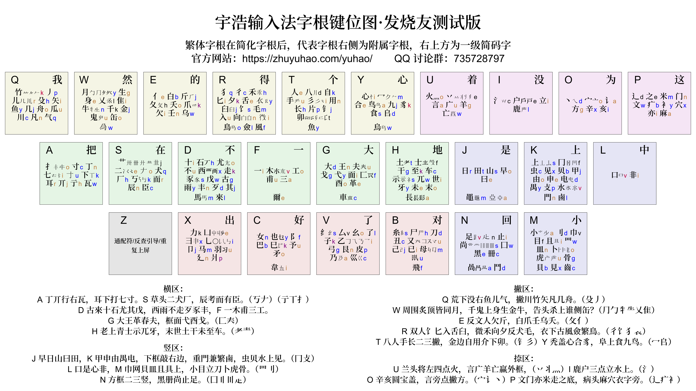

{: .warning }
>本區只用於功能測試和意見收集，不是正式版本，也不完全反映未來發展方向。

<!-- omit in toc -->
# 發燒友測試區

每天我們會收到大量的意見的建議。爲了更直觀地反映出這些建議的實際使用情况，我們建立了這個「發燒友測試區」，並且生成「發燒友測試版」方案。這個方案融合並展現了部分建議的實際效果，它也部分反映出宇浩輸入法未來可能的發展方向。

發燒友測試版方案各平臺碼表都儲存在 [/beta 文件夾下](https://github.com/forFudan/yuhao/tree/main/beta/)。

發燒友測試版方案的[在线拆分查询系统](../../beta/chaifen)提供臺灣字形拆分。

發燒友測試版方案的[在線字根練習](../../beta/practice/practice.html)也已上線。

歡迎試用並提出寶貴意見！

## 臺灣字形

增加近四千個臺灣字形兼容拆分，調整臺灣方案簡碼。凡臺灣繁體詞語，都使用臺灣字形編碼。比如「起來=走己來」`DBDl` 和「起=走巳來」`DCDl` 兼收。

在線拆分系統現也增加臺灣拆分一欄。

## 四重註解

RIME 提供拆分、編碼、拼音、字符集四重註解，卽額外增加拼音註解。

## 單字編碼

爲了減少全碼碼長，宇浩輸入法在每個大碼上設置了一個小碼爲 v 的字根，如果两根字末尾是v，則可以省略這個 v。

這個規則遭到了很大的詬病。根据要求，发烧友测试版中，單字編碼規則簡化如下：

1. 依次取一、二、三、末根大碼。
2. 不足四碼時，補上末根小碼。
3. 仍然不足四碼时，補上首根小碼。

## 字根編碼

字根字編碼，在正式版中，代表字根加f，附屬字根加 ff。這對 f 鍵不够友善。故而在测试版方案中改爲：

- 代表字根：全碼爲三碼，重複小碼，Aaa
- 附屬字根：全碼爲四碼，重複小碼，Aaaa

卽使設置了二級簡碼，常用代表字根三碼位依然保留，满足全碼黨的需求。

{: .note }
>改動後，字根字編碼規則同單字編碼規則一致。  
>假設字根大碼爲 A，小碼爲 a。首先，依次取一、二、三、末根大碼，故取 A。接着，不足四碼，故補上末根小碼，故取 a。最後，仍然不足四碼，故補上首根小碼 a。最終編碼爲 Aaa。

## 字根合併

以下字根進行歸併：

- 「礻」歸併至「示」上，因爲這兩個偏旁經常混同，尤其在大字集下分辨不易，不如合併來得痛快。
- 「灬」歸併至「火」上。因爲四點就是火。
- 單獨設立「丷」字根，兩點都歸到此字根上。

## 小碼優化

根據大量反饋，我們將字根小碼去 v 化，改用拼音中的字母。小碼設置方法如下：

- 主要用聲母。
- 聲母已被其他字根使用，或爲增加互擊，則使用其韻母中的字母。如：羊 Ug，手 Tu。
- 有些拼音不是很熟悉的字根，小碼等於 v 或其大碼。如：彐 Xx，宀 Oo。
- 另外，偶爾也用 d f j k 來提高手感和互擊。如：八 Td，辶 Pd，力 Xk。
- 尽量均衡「二码常用汉字密度」。「二码常用汉字密度」，就是头两码为 AB 的常用繁简汉字的数量。我们应当使二简文字密度尽量大于一个阈值，使得二简字效率更高。其中，将字根字直接放在文字密度低的位置上，是一个非常直接、便捷、有效的方法。

v 轉其他字母（由三碼變成四碼，基本不用特别記憶）：

- 扌 Av -> Ao 韻母
- 尸 Bv -> Bh 聲母
- 女 Cv -> Cn 聲母
- 石 Dv -> Dh 聲母
- 亻 Ev -> Ee 韻母，和「人」Te小碼一致
- 王 Gv -> Gn 聲母，汉字密度 Gw25 Gn7
- 土 Hv -> Ht 聲母
- 氵 Iv -> Ic 分散雙手
- 日 Jv -> Jr 聲母
- 虫 Kv -> Kc 聲母，汉字密度 Kv7 Kc3
- 宀 Ov -> Oo 韻母「寶」，拼音少見，重複大碼
- 竹 Qv -> Qk 聲母 z 轉 k
- 犭 Rv -> Rq 聲母，和「犬」Sq 小碼一致
- 𠂇 Sv -> So 拼音少見，重複大碼
- 钅 Tv -> Tj 聲母
- 火 Uv -> Uo 韻母
- 月 Wv -> Wy 聲母，汉字密度 Wy7 Wv12
- 彐 Xv -> Xx 聲母「雪」
- 冖 Yv -> Ym 聲母「冪」

其他小碼改變（主要爲了增強手感）：

- 十 Dh -> Di 韻母
- 西 Dh -> Dx 聲母
- 其 Dq -> Dj 聲母，減少小拇指負擔
- 壬 Ee -> En 韻母，分散雙手，汉字密度 Er22 En14
- 士 Hh -> Hf 分散雙手，汉字密度 Hf17 Hh26
- 户 Ih -> Ie 分散雙手
- 冂 Kg -> Kf 同 「匚」Gf小碼一致
- 水 Kh -> Kv 韻母 u 轉 v，汉字密度 Kv7 Kh13
- 目 Mu -> Mf 防止 Mu 單指大跨行
- 龰 Mh -> Nn 防止 Mh 單指跨行
- 虎 Mh -> Mu 韻母，汉字密度 Mh20 Mu6
- 之 Pc -> Pe 改善手感
- 辶 Po -> Pd 防止 Po 無名指小拇指連擊
- 艹 So -> Sj
- 卯 Ta -> Tm 聲母
- 丷 Uh -> Ue
- 乂 Wa -> Wl 分散雙手
- 巛 Vh -> Vc 聲母「川」
- 千 Wq -> Wk 防止 Wq 無名指小拇指連擊
- 凵 Xa -> Xg 韻母「丱」，防止 Xa 無名指小拇指連擊
- 豸 Yi -> Yk 聲母 z 轉 k
- 心 Yn -> Yi 韻母，防止 Yn 單指大跨行
- 八 Tb -> Td 防止 Tb 單指大跨行
- 力 Xl -> Xk 降重，汉字密度 Xk7 Xl10

## 單字拆分

單字拆分更变：

- 「丘」字由「亻工」改爲「斤一」。[值得商榷]
- 「夜」字由「亠亻夂丶」改爲「亠亻夕乀」。
- 設置反過來的「彐」字根。虐 = 虎彐

## 重碼數據

没變。

| 形码方案    | GB2312 | 通规一二级 | 国字常用 | 常用繁简 |  GBK | 简体选重率 | 繁体选重率 | 繁简混合文本选重率 |
| :---------- | -----: | ---------: | -------: | -------: | ---: | :--------- | :--------- | :----------------- |
| 宇浩·正式版 |    313 |        271 |      214 |      583 | 5015 | 5.5‱       | 15.6‱      | 17.7‱              |
| 宇浩·發燒版 |    312 |        265 |      210 |      589 | 5159 | 5.2‱       | 15.3‱      | 17.1‱              |

## 字根圖

<!-- ## 其他

設置漢字拆分圖示，不同顔色表示不同拆分。 -->
