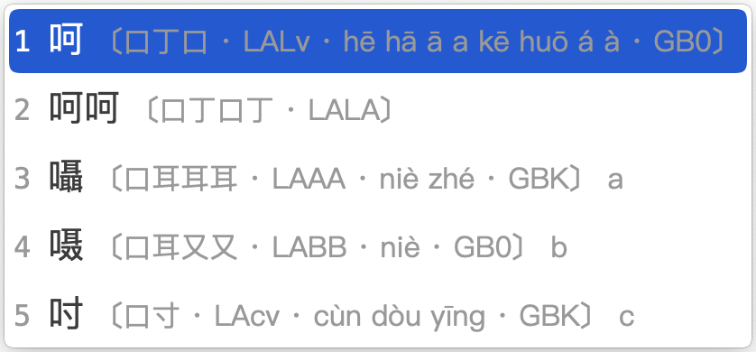
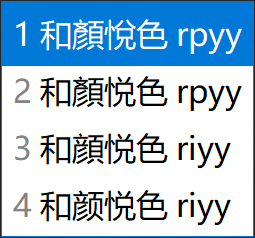

<!-- omit in toc -->
# 各平台下载和安装
{: .no_toc }

  

    目录
  

  {: .text-delta }
1. TOC
{:toc}

{: .highlight }
>[v1.4.3下载](https://github.com/forFudan/yuhao/releases/tag/v1.4.3)  
>[v2.0.0-beta.1下载](https://github.com/forFudan/yuhao/releases/tag/v2.0.0-beta.1)  
>[备用下载地址](https://gitee.com/forFudan/yuhao/releases/)  

## 码表直接挂载

本方案的码表可以在任何手机或电脑的输入法 App 上挂载并使用，比如百度、搜狗、落格、小小等。由于本方案只使用25键，故而可以完美挂载在任何五笔字型输入法的平台上，并使用`Z`键的功能。

[点击此处下载最新版本的各平台码表](https://github.com/forFudan/yuhao/releases)。[备用下载地址](https://gitee.com/forFudan/yuhao/releases/)。

码表因其格式，可以通用于多种平台。以下为几种主要格式的介绍：

- 宇码  空格  字符，UTF-8。此为**百度格式**，适用于百度输入法、搜狗输入法、清歌输入法。加上表头后，也适用于小小输入法、微软输入法、Fcitx输入法。
- 字符  Tab  宇码，UTF-8。此为**多多格式**，适用于落格输入法、小胖输入法。加上表头后，也适用于RIME输入法。还能用作[木易跟打器](https://typer.owenyang.top)的词提上传。
<!-- - 宇码  Tab  字符，UTF-8。此为**大竹格式**，用于大竹词提生成。 -->

### 百度/搜狗手机输入法

百度手机输入法挂载码表方法如下：

- 将 /baidu 下的码表下载到设备上
- 进入百度输入法 iOS 版
- 点击「我的」
- 点击右上方设置按钮
- 点击「输入设置」
- 点击「五笔输入」
- 点击「自定义方案」
- 点击「导入方案」
- 选择下载的码表文件，导入后即可使用

「搜狗输入法」挂载码表方法同百度输入法。

「清歌输入法」码表同百度输入法。

### 落格输入法

安装方法如下：

- 将 /duoduo 下的码表下载到电脑上。
- 进入输入法程序。
- 选择「Wifi传表」。
- 将码表传入手机中。
- 回到落格输入法的设置界面，在主码表中选择「yuhao」即可使用。

### 小小输入法

小小输入法码表是将 /baidu 下的「小小配置.txt」中的内容复制到码表文件顶部。

### 纯单字全码码表

纯单字全码码表是**宇浩单字全码.txt**。

纯单字全码和简码码表是**宇浩单字全码和简体简码.txt**。

## RIME 平台安装（小狼毫、鼠须管、同文、iRime、仓输入法）

下面介绍的是挂载于[RIME平台（小狼毫、鼠须管、同文、iRime）](https://rime.im/)的方案。我对它进行了深度定制，具有以下特点：

- 提供至 CJK-I 区、兼容区、部首区超过99000个汉字的完整拆分、编码提示、字集提示。
- 支持自定义字符集过滤生僻字。常用字约一万字，包括GB2312汉字、國語常用字、其它常用汉字等。支持用户自定义修改。
- 提供四码只出单字功能，适合单字派。
- 提供生僻字后置、生僻字屏蔽功能。

在安装了 Rime（小狼毫、鼠须管、同文、iRime）后，[在这个页面下载最新版本的 Rime 方案](https://github.com/forFudan/yuhao/releases)。 文件夹下的**所有文件**复制到**用户文件夹**下（可以右击 Rime 图标后点击「用户文件夹」来打开）。点击「部署」之后即可使用。

方案文件介绍：

- yuhao.schema.yaml 为简化汉字设置简码的方案，名为「开来学」。
- yuhao_tradition.schema.yaml 为传统汉字大陆字形设置简码的方案，名为「繼往聖」。
- yuhao_tradition_tw.schema.yaml 为传统汉字台湾字形设置简码的方案，名为「書同文」。
- yuhao.dict.yaml 主码表，用来调用其他码表。
- yuhao_tradition.dict.yaml 主码表，用来调用其他码表。
- yuhao.full.dict.yaml 单字全码码表。
- yuhao.quick.dict.yaml 简化字简码码表。
- yuhao_tradition.quick.dict.yaml 传统汉字简码码表。
- yuhao_tradition_tw.quick.dict.yaml 传统汉字台湾字形简码码表。
- yuhao.words 宇浩核心简体词库。约50000个词语，频率较高。
- yuhao.words_extended 宇浩增广简体词库。约30000个词语，频率较低，除非有特殊需求，否则不建议开启。
- yuhao.words_literature 宇浩成语诗词简体词库。约15000个成语和诗词，除非有特殊需求，否则不建议开启。
- yuhao_tradition.words 宇浩核心繁体词库，包括台湾、香港、大陆古籍繁体三种字形。约50000个词语，频率较高。
- yuhao_tradition.words_extended 宇浩增广繁体词库。约30000个词语，频率较低，除非有特殊需求，否则不建议开启。
- yuhao_tradition.words_literature 宇浩成语诗词繁体词库。约15000个成语和诗词，除非有特殊需求，否则不建议开启。
- yuhao.symbols.dict.yaml 特殊符号码表。
- yuhao_pinyin.schema.yaml 拼音配置文件，用于反查。
- yuhao_pinyin.dict.yaml 拼音字典文件。
- rime.lua 脚本设定。
- lua/yuhao/... 各种脚本。
- opencc/... 拆分表。

<!-- omit in toc -->
### 提示快捷键

输入`help`或`zzzz`或`bang`可显示快捷键提示。

<!-- omit in toc -->
### 单字拆分三重注解

提供至 CJK-I 区、兼容区、部首区超过99000个汉字的拆分、编码提示、字集提示。拆分提示中包括三重注解：

1. 该汉字的拆分。
2. 该汉字的全码。使用大小写字母区分字根的姓名。
3. 该汉字所在的字符集（CJK，CJK-A 到 CJK-I 区，兼容字等）。

用户还可通过「Shift+Ctrl+C」切换拆分状态。

（注：内测版 v2.0.0-alpha 提供四重注解，额外提示拼音。）

<!-- omit in toc -->
### 自定义常用字符集

本方案使用了自定的常用字符，将常用字一网打尽，避免了 RIME 内置字符集「GB2312字太少，GBK字太多」的问题。包括了以下一万个左右的字符：

- 《通用规范汉字表》中定义的，在 GB2312 字集内的汉字
- 台湾的「国字常用字」
- 286个大陆繁体字形
- 注音符号
- 「〇」符号

<!-- omit in toc -->
### 一键切换字符集

在输入过程中，用户可选择两种切换字集的方式：

- 通过「Shift+Ctrl+O」在常用字符集和CJK大字符集之间进行切换（过滤）。
- 通过「Shift+Ctrl+I」将常用字符集优先显示（优先）。

用户还可通过「Shift+Ctrl+F」进行简入繁出输入。

<!-- omit in toc -->
### Z 键功能键

#### 使用 Z 键引导拼音反查

按下 Z 键，可以随时使用拼音输入词语，并实现反查。

反查字典中，繁简体同权重，繁体字形包括大陆古籍、台湾繁体、香港繁体、OpenCC繁体四套字形标准。

<!-- omit in toc -->
#### 使用 Z 键作为通配符/学习符

除第一码外，可以使用z键代替其他编码，方便一下子忘记字根姓名的你继续输入。

<!-- omit in toc -->
#### 使用 Z 键上屏历史输入

可以使用`z`键快速上屏最近的历史输入。

<!-- omit in toc -->
### 输入特殊符号

本方案可以用编码输入特殊符号，包括标点符号、注音符号、日语假名（训令罗马字）等。只要输入引导符号：

- `fh`引导注音符号。例如：ㄤ，`fhan`
- `jm`引导日语假名。例如：あ，`jma`
- `py`引导拼音字母。例如：ǎ，`pya`
- `bd`引导中文标点。例如：分号，`bdfh`
- `dy`引导德语字母。例如：ß，`dyss`
- `yj`引导易经六十四卦符号。例如：䷾（既济），`yjkl`。
- `kk`引导其他符号。

<!-- omit in toc -->
### 精确造词

输入过程中，按下 ` 符号作为分隔，使用**数字键或空格键**依次选择单字，即可实现精确造词。

<!-- omit in toc -->
### 全码屏蔽词语

一键屏蔽四码词语，同时保留简码词。热键为「Shift+Ctrl+D」。适合保留简码词的单字简词派。
