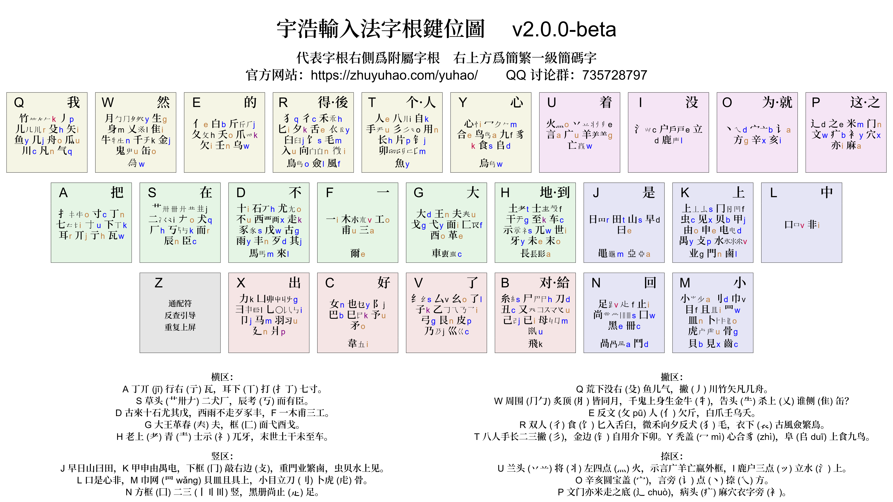

{: .warning }
>本區只用於功能開發、版本測試和意見收集。
>最新測試版本爲公測版本 [v2.0.0-beta](https://github.com/forFudan/yuhao/releases/tag/v2.0.0-beta)

<!-- omit in toc -->
# 宇浩二代開發測試版

每天我們會收到大量的意見的建議。爲了更直觀地反映出這些建議的實際使用情况，我們建立了這個「開發測試區」，並且生成「測試版」方案。這個方案融合並展現了部分建議的實際效果，它也部分反映出宇浩輸入法 v2.0.0 的發展方向。

- 測試版方案各平臺碼表都儲存在 [/beta 文件夾下](https://github.com/forFudan/yuhao/tree/main/beta/)。
- 文件夾 [generator](https://github.com/forFudan/yuhao/tree/main/beta/generator) 包含三個用來生成一級、二級、三級簡碼字詞的文件。

歡迎試用並提出寶貴意見！如果有新功能或者發現問題，可以直接 pull request。

## 臺灣字形

增加近四千個臺灣字形兼容拆分，調整臺灣方案簡碼。凡臺灣繁體詞語，都使用臺灣字形編碼。比如「起來=走己來」`DBDl` 和「起=走巳來」`DCDl` 兼收。

在線拆分系統現也增加臺灣拆分一欄。

## 單字編碼

單字編碼規則簡化如下：

1. 依次取一、二、三、末根大碼。
2. 不足四碼時，補上末根小碼。
3. 仍然不足四碼时，補上首根小碼。

## 字根編碼

字根字編碼改爲：

- 代表字根：全碼爲三碼，重複小碼，Aaa
- 附屬字根：全碼爲四碼，重複小碼，Aaaa

卽使一個字根字設置了一、二級簡碼，其全碼位依然保留，不另外設置其他漢字的三級簡碼，以满足全碼黨的需求，如：

- 「水」全碼爲 Kvv，爲它設置了二級簡碼 Kv，但 Kvv 依舊可以得到「水」字，不另設「關」字在此三碼碼位上。

注意到，改動後，字根字編碼規則同單字編碼規則一致：假設字根大碼爲 A，小碼爲 a。首先，依次取一、二、三、末根大碼，故取 A。接着，不足四碼，故補上末根小碼，故取 a。最後，仍然不足四碼，故補上首根小碼 a。最終編碼爲 Aaa。

## 字根改變

以下字根進行歸併：

- 「礻」歸併至「示」上，因爲這兩個偏旁經常混同，尤其在大字集下分辨不易，不如合併來得痛快。
- 「灬」歸併至「火」上。因爲四點就是火。
- 單獨設立「丷」字根，兩點都歸到此字根上。

以下字根被認定：

- 認定「业」爲字根，編碼爲 Kg
- 認定反過來的「彐」字根同「彐」，如 虐 = 虎彐
- 認定「𦣞」「𦣝」字根同「臣」，如 熙 = 臣巳灬，姫 = 姬 = 姬 = 女臣
- 認定 𬻂 = 卌一，「帶」上同「𬻂」

以下字根被删除：

- 删除「四豎」字根，因爲只在字集中被使用了一次。

## 小碼優化

根據大量反饋，我們將字根小碼去 v 化，改用拼音中的字母。小碼設置方法如下：

- 主要用聲母。
- 聲母已被其他字根使用，或爲增加互擊，則使用其韻母中的字母。如：羊 Ug，手 Tu。
- 另外，偶爾也用 d f j k 來提高手感和互擊。如：八 Ti，辶 Pd，力 Xk。
- 尽量均衡「二码常用汉字密度」。「二码常用汉字密度」，就是头两码为 AB 的常用繁简汉字的数量。我们应当使二简文字密度尽量大于一个阈值，使得二简字效率更高。其中，将字根字直接放在文字密度低的位置上，是一个非常直接、便捷、有效的方法。

小碼 v 轉其他字母（由三碼變成四碼，基本不用特别記憶）：

- 扌 Av -> Ao 韻母
- 尸 Bv -> Bh 聲母
- 女 Cv -> Cn 聲母
- 石 Dv -> Dh 聲母
- 亻 Ev -> Ee 韻母，和「人」Te小碼一致
- 王 Gv -> Gn 聲母，汉字密度 Gw25 Gn7
- 土 Hv -> Ht 聲母
- 氵 Iv -> Ic 分散雙手
- 日 Jv -> Jr 聲母
- 虫 Kv -> Kc 聲母，汉字密度 Kv7 Kc3
- 宀 Ov -> Ob 聲母「寶蓋」，拼音少見，重複大碼
- 竹 Qv -> Qk 聲母 z 轉 k
- 犭 Rv -> Rq 聲母，和「犬」Sq 小碼一致
- 𠂇 Sv -> So 拼音少見，重複大碼
- 钅 Tv -> Tj 聲母
- 火 Uv -> Uo 韻母
- 月 Wv -> Wy 聲母，汉字密度 Wy7 Wv12
- 彐 Xv -> Xl 分散雙手

偏旁部首改變小碼（因爲存在簡碼，影響很小）：

- 冂 Kg -> Kf 同 「匚」Gf小碼一致
- 龰 Nh -> Nf 防止 Nh 單指跨行
- 辶 Po -> Pd 防止 Po 無名指小拇指連擊
- 艹 So -> Sj
- 卯 Ta -> Tm 聲母
- 丷 Uh -> Ue
- 巛 Vh -> Vc 聲母「川」
- 乂 Wa -> Wl 分散雙手
- 凵 Xa -> Xg 韻母「丱」，防止 Xa 無名指小拇指連擊
- 豸 Yi -> Yk 聲母 z 轉 k

其他小碼改變（主要爲了增強手感，需要特别記憶）：

- 飛 Bf -> Bk 分散雙手
- 阝 Cf -> Cj 分散雙手
- 十 Dh -> Di 韻母
- 西 Dh -> Dx 聲母
- 其 Dq -> Dj 聲母，減少小拇指負擔
- 壬 Ee -> En 韻母，分散雙手，汉字密度 Er22 En14
- 士 Hh -> Hf 分散雙手，汉字密度 Hf17 Hh26
- 户 Ih -> Ie 分散雙手
- 立 Ii -> Id 分散雙手
- 早 Jo -> Jd 連續小碼「日十」分散雙手
- 水 Kh -> Kv 韻母 u 轉 v，汉字密度 Kv7 Kh13
- 目 Mu -> Mf 防止 Mu 單指大跨行
- 虎 Mh -> Mu 韻母，汉字密度 Mh20 Mu6
- 之 Pc -> Pe 改善手感
- 二 Se -> Si 改善手感
- 乃 Va -> Vj 分散雙手
- 身 We -> Wm 分散雙手
- 千 Wq -> Wk 防止 Wq 無名指小拇指連擊
- 心 Yn -> Yi 韻母，防止 Yn 單指大跨行
- 九 Yj -> Yf 分散雙手，汉字密度 Yj19 Yf11
- 彡 Ti -> To 讓出碼位給「八」
- 八 Tb -> Ti 防止 Tb 單指大跨行，分散雙手
- 力 Xl -> Xk 降重，汉字密度 Xk7 Xl10

## 單字拆分

單字拆分更變：

- 「丘」字由「亻工」改爲「斤一」。
- 「夜」字由「亠亻夂丶」改爲「亠亻夕乀」。

單字拆分更正：

- 𦥷 = ⺽且八
- 𠴿 = 口𰃦𠀎
- 𦣵 = 臣𠂉卌𠄎日夊
- 𭺄 = 王日罒方
- 𠦑 = 丶廾⺀丶
- 𱍓 = 𠂇手丿乀
- 𮠐 = 勹口古月阝
- 曱 = 冂干

## 簡碼設置

優化簡碼設置：

- 一、二級簡碼儘量不設置三選簡詞。
- 二級簡碼非必要不設置二選簡詞。
- 三級簡碼只對常用繁簡漢字進行設置。次常用漢字不再設置三級簡碼。
- 二級簡碼三選位上設置標點符號快速輸入。如：分號；在 fh 上，書名號《》在 sm 上。

## 全碼排序

全碼排序時，不再對已設置了簡碼的單字全碼進行後置。需要此功能可以在輸入平臺開啓。

## 四重註解

RIME 提供拆分、編碼、拼音、字符集四重註解，卽額外增加拼音註解。

四重註解中，單字、詞語編碼用大小寫來區分大小碼。

## 預選顯示候選

RIME 平臺可通過 Shift + Ctrl + E 快捷鍵，將候選字顯示在預選區中。

作者：[王牌餅乾](https://github.com/lost-melody/)

## 功能開關一鍵配置

RIME 平臺加入「功能開關一鍵配置」文件，方便用户切換設置：

- yuhao.custom.yaml
- yuhao_tradition.custom.yaml
- yuhao_tradition_tw.custom.yaml

## 重碼數據

基本没變。

| 形碼方案    | GB2312 | 通規一二級 | 國字常用 | 常用繁簡 |  GBK | 簡體選重率 | 繁體選重率 | 繁簡混合文本選重率 | 簡體詞語选重率 |
| :---------- | -----: | ---------: | -------: | -------: | ---: | :--------- | :--------- | :----------------- | :------------- |
| 宇浩·v1.4.3 |    313 |        271 |      214 |      583 | 5015 | 5.5‱       | 15.6‱      | 17.7‱              | 119.6‱         |
| 宇浩·v2.0.0 |    314 |        265 |      208 |      583 | 5171 | 5.2‱       | 15.3‱      | 17.1‱              | 116.1‱         |

## 字根圖

## 字根表

| 分區 | 大碼 |                                                                                                                    字根 |
| :--- | :--- | ----------------------------------------------------------------------------------------------------------------------: |
| 横   | A    |                                                寸 c  亍 h  七 i  丌 j  下(丅) k  丁 n  扌(キヰ) o  耳 r  {于下} u  瓦 w |
|      | S    |                                               臣 c  厂 h  二(⺀) i  艹(卌卅{冓上}龷) j  丂 k  辰 n  {左上} o  犬 q  而 r |
|      | D    |            歹 d  古 g  石(丆) h  十 i  其 j  走 k  來 l  馬({馬上}) m  丰 n  尤(尢) o  豕 s  不 u  戊 w  西(襾) x  雨 y |
|      | F    |                                                                                      三 a  爾 e  一 i  工 o  甫 u  木 v |
|      | G    |                                         車(叀{專上}) c  大 d  革 e  匚({畏下}) f  戈 g  面 i  王 n  酉 o  夫(𡗗) u  弋 y |
|      | H    |                              長(髟镸) a  车 c  未 e  士({穀頭}龶) f  干 g  世 i  至 k  末 o  示 s  土(耂) t  兀 w  牙 y |
| 竖   | J    |                                                            {亞下}({亞中}) a  早 d  曰 e  黽({龜下}) m  日 r  山 s  田 t |
|      | K    |              贝 b  虫 c  电 d  申 e  冂({雋下}{冂丶}) f  业 g  甲 j  鹵 l  門 n  由 o  攴 p  上(丄) s  水 v  见 x  禺 y |
|      | L    |                                                                                                              非 i  口 v |
|      | M    |                      小 a  貝 b  齒 c  刂 d  目 f  骨 g  且 i  皿 n  卜({乍下}{龍右}) o  虎({虎头}) u  巾 v  罒 w  見 x |
|      | N    |                                                      咼(冎) a  冊 c  鬥 d  黑 e  龰 f  止 i  尚(〣龸丨〢) s  足 v  囗 w |
| 撇   | Q    |                                   川 c  殳 h  矢 i  几 j  竹({⺮右}) k  凡 n  舟 o  丿 p  气 q  儿({荒下}) r  瓜 u  鱼 y |
|      | W    |                           生 g  隹 i  金 j  千 k  乂(𠂭) l  身 m  牛(⺧) n  缶 o  鬼({卑上}) u  {爲下} w  月({祭上}⺆勹) y |
|      | E    |                                                                 白 b  亻 e  夂 h  欠 i  斤(⺁) j  爪 k  壬 n  夭 o  乌 w |
|      | R    | 彳 c  舌 e  風 f  禾 h  {微上} i  匕 i  臼 j  夕 k  僉 l  毛 m  向({囟框}{向框}) n  鳥({鳥上}) o  犭 q  饣 s  入 u  𧘇 y |
|      | T    |    人 e  长 h  八({介下}) i  钅 j  自 k  卯({卬左}{齊右}{卯左}{乐上}) m  用 n  彡({癶右}{两撇}) o  片 p  手(龵) u  魚 y |
|      | Y    |                                                 鸟({鸟上}) a  𠂤 d  合 e  九 f  心(忄) i  豸 k  冖 m  食 s  烏({烏上}) w |
| 捺   | U    |                                                                  言 a  丷(丬䒑リ) e  羊 g  火(灬) o  广 u  亡({贏頭}) w |
|      | I    |                                                                                 氵(⺍) c  立 d  户(戸戶) e  鹿({鹿上}) l |
|      | O    |                                                                        讠 a  宀({齊頭}亠) b  丶(乀) d  方 g  亥 i  辛 x |
|      | P    |                                                              麻 a  疒 b  辶 d  之 e  亦 i  米 m  门 n  文 w  穴 x  衤 y |
| 折   | B    |                          丑 c  刀 d  尸({眉上}) h  已 i  己 j  飛 k  母({母框}{互中}) m  糸 s  {鼠下} u  又(コマス癶) u |
|      | V    |                                        巛(巜) c  弓 g  乙(㔾) i  乃 j  子 k  了 l  艮 n  幺 o  皮 p  纟({纟上}) s  厶 v |
|      | C    |                                                              巴 b  韋({五下}) i  阝 j  巳 k  女 n  矛 o  予 u  也(乜) y |
|      | X    |                                          凵(丱屮丩) g  乚(〇) i  卩 j  力 k  彐(肀{反彐}) l  马 m  廴 n  爿 p  羽(习) u |

<!-- ## 其他

設置漢字拆分圖示，不同顔色表示不同拆分。 -->
