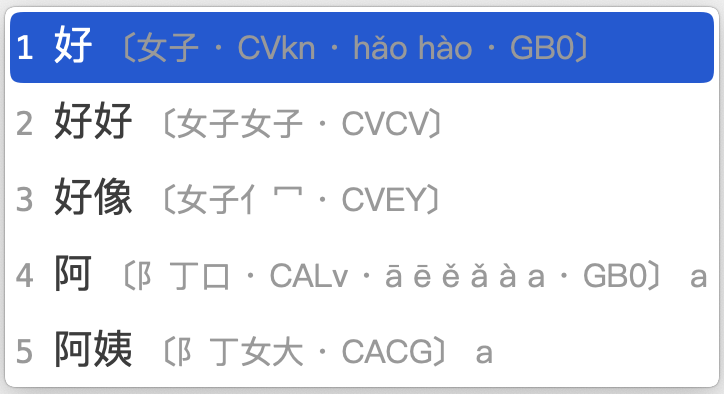

<!-- omit in toc -->
# 宇浩·情繫漢字·溝通古今
{: .no_toc }

  

    目录
  

  {: .text-delta }
1. TOC
{:toc}

{: .highlight }
>点击加入官方QQ群: [735728797](https://jq.qq.com/?_wv=1027&k=2OYDP4Tk)  
>[正(繁)體字版官方網站](https://zhuyuhao.com/yuhaoim)  
>[稳定版v1.4.3下载](https://github.com/forFudan/yuhao/releases/tag/v1.4.3) ·
>[内测版v2.0.0-alpha.3下载（四重注解）](https://github.com/forFudan/yuhao/releases/tag/v2.0.0-alpha.3)  
>[快速入门](./docs/cookbook) ·
>[详细教程](./docs/learn) ·
>[在线练习](./docs/practice) ·
>[更新日志](./docs/updates/updates) ·
>[拆分查询](./chaifen/)  

## 简介

宇浩输入法是一款纯字形输入法，不依赖读音实现全漢字输入。它具有以下优点：

- 重码率极低。一字一码，可以不看输入栏、不用选字、不用翻页，甚至闭上眼睛，流畅地进行写作。
- 繁简字分离，不存在共用码位现象，故而繁简混合文本也不需要选重。比如：「简」`QPJv`，「簡」`QKJv`。
- 繁體字形涵蓋[大陸古籍](./docs/articles/guji)[^guji_standards]、臺灣、香港、OpenCC[^opencc_standards] 四套標準。比如：「起=走己」`DBjk` 和「起=走巳」`DCKk` 兼收。
- 设置简体、繁体两套词库。繁體詞庫涵蓋四套標準。繁體輸入體驗也極爲優秀。
- 面向大字集，全面覆盖 CJK 全字集 99000 多个漢字和部首（更新至 CJK 扩 I 区），可以用宇浩输入法打出所有生僻字。
- 字根在键盘上分横、竖、撇、捺、折五区排布，摒除乱序，便于上手。采用大字根，拆法更直观，不会将漢字拆得零碎。
- 双编码，不分主副根，没有结构码。全简一致，规则简单。取一、二、三、末字根，思维负担较轻。
- 拆字规则优先级明确，兼顾「逻辑性」和「直观性」。保证一字一拆、无歧义。
- 只使用25键，不使用Z键，手感好。中排、上排按键频率都超过40%。最高频的漢字一级简码位于最容易按的键上：`E的`、`F一`、`V了`、`I没`。
- 线性的学习体验，[教程详尽。](./docs/learn)在简快码的加持下，只用记住100个字根，就能基本输入最常用的500个漢字，其他字根可以边打边学。

[阅读《快速入门指南》，十分钟了解宇浩输入法的基本规则。](./docs/cookbook)

[点击这里，使用字根练习小程序，直接学习最常用的100个字根。](./practice/practice_100.html)两个小时后，你就可以开始上手打字了。

## 特点

### 极致低重

宇浩输入法不仅适合简体输入，也可能是当前市面上最优秀的繁体输入法。它在简体、繁体文本下的表现有多好呢？不妨看一看下面的数据：

- 简体文本：常用 1500 字全码无重[^frequent_characters]。常用 3000 字，全码 12 组重码，出简后无重码。常用 4500 字，全码 57 组重码，出简后 2 组重码。常用 6000 字，全码 114 组重码，出简后 29 组重码。字频加权后，全码下每万字选重 5 次。

- 繁体文本：常用 1500 字，全码 1 组重码，出简后无重。常用 3000 字，全码 25 组重码，出简后无重码。常用 4500 字，全码 92 组重码，出简后 6 组重码。常用 5700 字，全码 158 组重码，出简后 38 组重码。字频加权后，全码下每万字选重 16 次。

- 繁简混合文本[^mixed_frequency]：前 1500 字，全码 3 组重码，出简后无重。前 3000 字，全码 25 组重码，出简后 3 组重码。前 6000 字，全码 136 组重码，出简后 13 组重码。前 9000 字，全码 376 组重码，出简后 100 组重码。字频加权后，全码下每万字选重 17 次。

要知道，宇浩输入法只使用了25个按键，也就是说四码的编码空间只有其他26键输入法的85.5%。但是宇浩输入法在常用繁简漢字下重码表现却是同类输入法中最好的。

### 繁简通打

绝大多数输入法，简体字和对应的繁体字都占用相同的码位，导致输入繁体时需要选重。比如五笔字型中，「簡」「简」两个字的编码都是`TUJf`。如果我想打繁体的「簡」，需要按一下选重键。因此，大多数输入法在繁体文本或繁简混合文本下，不具备盲打的优势。

宇浩输入法繁简漢字分离，不存在共用码位现象，故而繁简混合文本也不需要选重。你可以按照自己的喜好随时切换繁简状态，不需要软件转换，更不需要担心因为繁体字位于简体字的下方而需要选重。可以像写字一样随心切换任何字形。

比如，「简」`QPJv`、「簡」`QKJv`这两个繁简漢字在宇浩输入法中对应了不同的编码。这是因为宇浩输入法的「门」字根繁简分离。在很多输入法中，由于繁简字根位于同一个按键，你需要从候选栏中选择繁体字还是简体字。

### 适合人群

评价一款输入法，不能只看重码率，因为每一款输入法都有自己的**设计哲学**和**目标用户**。有优点就必然有缺点，反之亦然。评价一款输入法的维度，除却重码率，还有规则简易度、字根复杂度、按键舒适度、平台通用性等。这就是为什么拼音重码高，但大多数人还是会使用拼音，因为它的学习成本基本为零。选择学习输入法，一定要符合自己的需求，要综合考虑多方面因素，例如，是否愿意背较多的字根，是否有打古文、繁体字需求等。

宇浩输入法的最佳输入体验，是采用精简词库（80000词左右，同时包括简体、台湾繁体、香港繁体、大陆繁体）并配合单字输入，从而达到极致的确定性，做到完全关闭候选框输入。以下为宇浩输入法**最适合**的人群：

- 对繁体字和简化字都有输入需求，希望做到繁简无缝切换，不依赖程序进行转换的人（中文系学生、经常同两岸三地人士打交道者、方言爱好者、漢字爱好者等）；或
- 日常主要输入繁体文本的人（港澳台用户）；或
- 日常需要输入简体文本，偶尔需要输入繁体文本和生僻字的人；或
- 热爱漢字，喜欢一笔一画写字的感觉，想要学习传统漢字的人。

{: .note }
宇浩输入法的设计哲学是：**实用**、**直观**、**科学**、**理性**。实用，指的是完全以输入而非检字进行设计；直观，指的是对漢字的拆分直观易懂；科学，指的是对于编码和简码的设计科学合理，并符合统计频率；理性，指的是拆字规则逻辑严明、没有二义，也指社群抱着理性和开放的态度去面对批评和建议，积极修正存在矛盾的、不正确的拆分。

<!-- ## 网站导航

手机用户可点击页面右上方的「三横」按钮查看导航栏。本网站结构如下：

- [宇浩输入法的下载、安装的方法](./docs/install)：宇浩输入法支持所有平台，并且在 iOS 商店中可以通过下载免费的[「仓输入法」](https://apps.apple.com/us/app/仓输入法/id6446617683)直接使用。
- [快速入门指引](./docs/cookbook)：包括字根图、字根分区、单字编码规则、词语编码规则等。适合有一定形码知识的用户阅读。
- [详细教程和规则细节](./docs/learn)：包括宇浩输入法完整、详尽的规则介绍。适合新手阅读，也适合高手备查。
- [字根和常用字练习](./docs/practice)：宇浩输入法通过数据统计，优化学习步骤，从最重要的字根学起，可以在短时间内上手打字，拉平学习曲线。
- [相关研究文章](./docs/articles/articles)：包括一些输入法研究文章，比如[设计理念](./docs/articles/discussion)、常见的形码输入法[重码数据](./docs/articles/statistics)、古籍通规等。
- [宇浩输入法更新日志](./docs/updates/updates)和[单字拆分校正历史](./docs/updates/corrections)。
- [宇浩输入法在线拆分查询系统](./chaifen)：您可以在此处查询 99000 个漢字（至CJK-I区）的拆分，支持输入单字、词语、句子。 -->

{: .highlight }
[点击此处](./docs/articles/discussion)详细了解我对一款具有平衡性的输入法的一些思考和分析，以及宇浩输入法的设计理念和基本考量（陆标繁体书写）。

## 衍生作品

### 宇浩三码顶

宇浩三码顶是一个宇浩输入法的衍生方案，基于宇浩的字根布局和拆分数据，引入三码顶字的输入方式。由于其不改变原宇浩的布局和拆分，可以实现和宇浩标准版间的无缝切换。

作者：王牌饼干

项目地址：[https://github.com/lost-melody/rime-smyh](https://github.com/lost-melody/rime-smyh)

### 宇浩查形

「宇浩查形」是由 Poto 开发的宇浩输入法查字打法软件，让你在使用宇浩时遇到不会打的字能知道拆分和打法。

项目地址：[https://ispoto.github.io/YuHaoDict/](https://ispoto.github.io/YuHaoDict/)

## 背景故事

讲讲背景故事吧。制作宇浩输入法，有几个契机：一个是十年前我写下[《上海话简明教程》](https://zhuanlan.zhihu.com/p/615631608)的时候，遇到了一个情况：有时候我脑海里想的是方言，但用拼音输入的时候，往往会卡壳或者错误。当时的我意识到**字形输入法**的重要性，于是部分使用了仓颉和五笔字形。

另一个契机是两年前，我开始写一本古典章回体小说，里面有大量的半文半白的句子，以及古典诗词。使用拼音和双拼，需要不断翻页找字，影响思维的连贯性。这更坚定了我完全使用形码进行创作的决心。

第三个契机是我在日常生活中，会大量使用简化字和繁体字：使用简化字同身边人交流，同时使用繁体字进行文学创作。因为我用笔写字的时候也使用陆标繁体，我并不需要输入法为我进行简繁转换。同时，简繁转换一对多的特点、不同标准下的字形有差异，导致转换往往会发生错误。我希望有这样一种输入法，能够分离繁简漢字，如同写字一样，想打繁体打繁体，想打简体打简体。

三个契机，也道出了我的三个需求：一、我需要一个不依赖于读音的输入法，也就是字形输入法。二、这个输入法的重码率要低，让我不用选字，流畅地输入。三、这个输入法能够做到繁简漢字分离，一字一码，不存在繁简共码现象。

市面上的输入法，满足上述三个条件的，在当时只有「仓颉」和「徐码」。因为仓颉是五码定长，没有简码和词语输入，所以效率不是很高。所以，我最终选择使用徐码，一年中，我定制了自己的 Rime 方案，还进行了全漢字的拆分。

使用繁体字写了一百万字的古典章回体小说后，我深感具备繁简通打能力的字形输入法妙不可言。当前市面上允许**繁简通打**的**四码定长**的字形输入法只有徐码，但它需要判断主副根，且回头码有时占据第四码，对于复杂漢字的拆分不是特别顺畅。基于这个原因，我决定暂时放下小说创作，使用 Python 制作一款在繁体、简体、繁简混合，这三种文本模式下都能进行盲打的方案。

特别的，我希望它能够做到规则简明、常用繁简字闭眼盲打、大字集检字方便。经过了一系列调试和改进，在同好们的支持和鼓励下，这款输入法终于大功告成。

到目前为止，我转用宇浩输入法又陆续写了十万多字的小说，感觉它在写作方面的确更加流畅。对每一个汉字的拆分也更加理性。

在此，需要感谢所有帮助过我，给我提过宝贵意见和建议的诸位同好。感谢五笔字型和郑码这两个形码界的里程碑，它们的很多理念被沿用。感谢徐码，它是第一个将繁简通打引入四码定长的方案，它的繁简混合低重奠定了宇浩输入法的高起点。

## 脚注

[^frequent_characters]: 「最常用漢字」的定义依赖于文本空间。关于本测评中所用的字频数据的来源，[请参阅此页面](./docs/articles/statistics)。

[^guji_standards]: 中华人民共和国国家标准《古籍印刷通用字规范字形表》（GB/Z 40637-2021）：[https://openstd.samr.gov.cn/bzgk/gb/newGbInfo?hcno=52E2DE28D439C1937EE09AE4B5AA615B](https://openstd.samr.gov.cn/bzgk/gb/newGbInfo?hcno=52E2DE28D439C1937EE09AE4B5AA615B)

[^opencc_standards]: 为 OpenCC 繁简转换程序所用字典：[https://github.com/BYVoid/OpenCC/blob/master/data/dictionary/STCharacters.txt](https://github.com/BYVoid/OpenCC/blob/master/data/dictionary/STCharacters.txt)

[^mixed_frequency]: 这里的繁简混合字频来源于简体字频和繁体字频。假设一个人一半时间打简体，一半时间打繁体，那么便适用于此数据。
