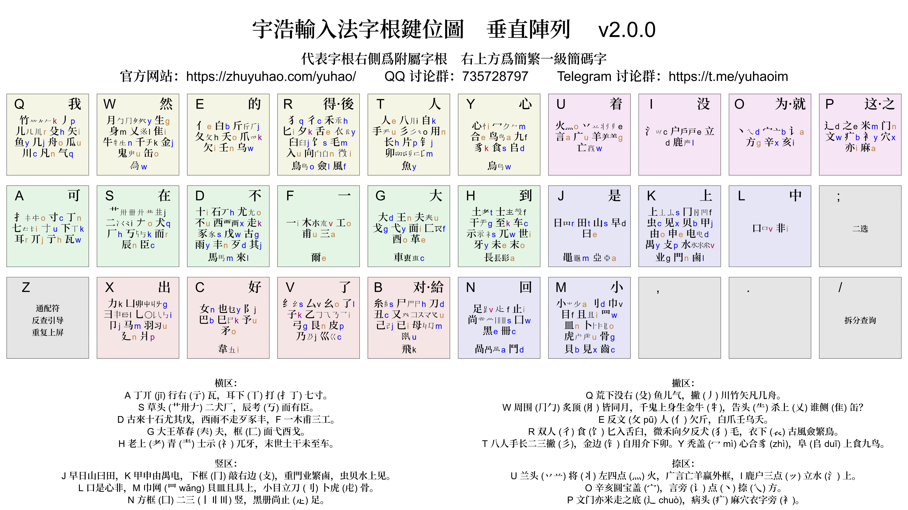
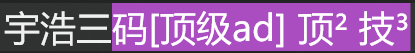

<!-- omit in toc -->
# 宇浩输入法
{: .no_toc }

{: .highlight }
**繁简通打　动静低重　字根聚类　兼顾手感**

  

    目录
  

  {: .text-delta }
1. TOC
{:toc}

{: .highlight }
>官方 QQ 群: [735728797](https://jq.qq.com/?_wv=1027&k=2OYDP4Tk) · 
>官方 TG 群: [yuhaoim](https://t.me/yuhaoim)  
>[最新版本下载](https://github.com/forFudan/yuhao/releases/) · 
>[备用下载地址](https://gitee.com/forFudan/yuhao/releases/)  
>[快速入门](./docs/cookbook) · 
>[详细教程](./docs/learn)  
>[**光華**练习程序](https://github.com/forFudan/yuhao/releases/download/v3.1.0/yuhao_light_practice_tool.exe) · 
>[**星陳**练习程序](https://github.com/forFudan/yuhao/releases/download/v3.1.0/yuhao_star_practice_tool.exe)  
>[**光華**拆分和编码查询](./light/chaifen/) · 
>[**星陳**拆分和编码查询](https://zhuyuhao.com/yustar/star/chaifen/)  

<!-- {: .note }
>本页面介绍的是宇浩·光華，其他版本信息请移步导航栏 -->

## 简介

宇浩输入法是一款纯字形输入法，不依赖读音实现全漢字输入。在设定一系列确保规律性和协调性的约束条件下，使用宇浩算法理论框架和程序工具，优化字根分布，达到顶尖的输入表现。宇浩输入法具有以下优点：

- 重码率极低，适合盲打。
- 繁简字分离，不存在共用码位现象，故而繁简混合文本也极少选重。比如：「简」「簡」不同碼。
- 字形兼容大陆通规、[大陆古籍通规](./docs/articles/guji)[^guji_standards]、臺灣正體三套標準。比如「起=走己」和「起=走巳」兼收。
- 设置简体、繁体词库。繁体词库亦涵盖两岸三地三套用字标准[^opencc]，输入体验十分优秀。
- 面向大字集，全面覆盖 CJK 全字集 99000 多个漢字和部首（更新至 CJK 扩 I 区），可以用宇浩输入法打出所有生僻字。检字方便，翻页少，全字集候选项最多的码位`DLYF`上只有16个候选字。
- 字根在键盘上呈规律排布，摒除乱序排布，便于理解学习。
- 采用大字根、双编码，拆法更直观，不会将漢字拆得零碎。分主副根，没有结构码。取一、二、三、末字根。全简一致。
- 拆字规则优先级明确，兼顾「逻辑性」和「直观性」。追求一字一拆、无歧义。
- 兼顾手感，大码只使用25键，不使用Z键，中排、上排按键频率都超过40%。

宇浩输入法目前有两套并行方案，设计理念一致，单字拆分统一，字根分布不同。

- **宇浩·光華**方案采用了字根首笔分区排布模式。字根在键盘上，依据其第一笔的笔画，分布在横竖撇捺折五区中。其中横区6键，竖区5键，撇区6键，捺区4键，折区4键。方案名取自《尚書大傳》之「日月光華，旦復旦兮」。

- **宇浩·星陳**方案采用了字根聚类同键排布模式。字型相似的字根会被聚拢在一道，排布在25个键位上。方案名取自《尚書大傳》之「明明上天，爛然星陳」。

两个方案的区别，可参见以下表格。

| 特点                       | 宇浩·光華 | 宇浩·星陈 |
| :------------------------- | :-------- | :-------- |
| 使用最新版本**宇浩拆分**   | ✅         | ✅         |
| 支持到 CJK ext-I           | ✅         | ✅         |
| 兼容台湾字形拆分           | ✅         | ✅         |
| 繁简通打低极选重率 (<0.2%) | ✅         | ✅         |
| 字根双编码                 | ✅         | ✅         |
| 附属根比代表根多补一码     | ✅         | ❌         |
| 大码使用 Z 键              | ❌         | ❌         |
| 小码使用 Z 键              | ❌         | ✅         |
| 相似字形字根同分区聚类     | ✅         | ❌         |
| 相似字形字根同大码聚类     | ❌         | ✅         |
| 小码使用拼音中的字母       | ✅         | ✅         |
| 小码 >85% 使用拼音首字母   | ❌         | ✅         |
| 双手互击率 >60%            | ❌         | ✅         |
| 严格优化键位分布           | ❌         | ✅         |
| Z 键反查                   | ✅         | ✅         |

当前，宇浩输入法的核心维护工作 90% 以上内容是修正和完善「宇浩拆分」、优化 Rime 平台功能。

## 特点

### 繁简通打
{: .no_toc }

绝大多数输入法，简体字和对应的繁体字都占用相同的码位，导致输入繁体时需要选重。比如五笔字型中，「簡」「简」两个字的编码都是`TUJf`。如果我想打繁体的「簡」，需要按一下选重键。因此，大多数输入法在繁体文本或繁简混合文本下，不具备盲打的优势。

宇浩输入法繁简漢字分离，不存在共用码位现象，故而繁简混合文本也不需要选重。你可以按照自己的喜好随时切换繁简状态，不需要软件转换，更不需要担心因为繁体字位于简体字的下方而需要选重。可以像写字一样随心切换任何字形。

比如，「简」`QPJr`、「簡」`QKJr`这两个繁简汉字在宇浩输入法中对应了不同的编码。这是因为宇浩输入法的「门」字根繁简分离。在很多输入法中，由于繁简字根位于同一个按键，你需要从候选栏中选择繁体字还是简体字。

以下视频展示了使用宇浩单字全码输入**繁简混合**版本的《洛神赋》的片段节选。可以看到，全文都没有进行过选重。因此，宇浩输入法特别适合任意文本空间下的盲打，以及古漢语输入。



### 动静低重
{: .no_toc }

宇浩输入法支持繁简通打，并不代表它牺牲了**只打简体**或**只打繁体**的性能。宇浩输入法适合**只输入简体**，也是当前市面上最优秀的繁体输入法之一。它在简体、繁体文本下的表现分别有多好呢？不妨看一看下面的数据：

- 简体文本：常用 1500 字全码无重[^frequent_characters]。常用 3000 字，全码 10 组重码，出简后无重码。常用 4500 字，全码 55 组重码，出简后 2 组重码。**常用 6000 字，全码 117 组重码，出简后 14 组重码。字频加权后，全码下每万字选重 5 次。**

- 繁体文本：常用 1500 字，全码 1 组重码，出简后无重。常用 3000 字，全码 24 组重码，出简后 4 组重码。常用 4500 字，全码 92 组重码，出简后 13 组重码。常用 5700 字，全码 152 组重码，出简后 36 组重码。字频加权后，全码下每万字选重 15 次。

- 繁简混合文本[^mixed_frequency]：前 1500 字，全码 3 组重码，出简后无重。前 3000 字，全码 13 组重码，出简后 3 组重码。前 6000 字，全码 131 组重码，出简后 16 组重码。前 9000 字，全码 365 组重码，出简后 92 组重码。字频加权后，全码下每万字选重 17 次。

要知道，宇浩输入法只使用了25个按键，也就是说四码的编码空间只有其他26键输入法的85.5%。但是宇浩输入法在常用繁简漢字下选重率却是同类输入法中最低的。

### 均衡优异
{: .no_toc }

**繁简通打、动静低重、字根聚类、兼顾手感**，这是宇浩输入法的四个基本设计原则，目的在于避免机器学习中的「过拟合问题」，防止输入法被局限于特定的文本空间和字形状态，以期获得更大的适用性。在保证这四个原则的基础上，作者还采用了其他的客观指标作为算法的约束条件，以提高输入法的整体素质，防止有严重的短板产生。做到「整体性能均衡，部分指标优异」。总结如下：

- 单字重码表现优异，无论是全码还是简码，在简化字静重、简化字动重、繁体字动重、繁简混合动重方面都是最低。繁体字和大字集静重仅次于徐码。
- 双手互击表现突出，在字根分区的限制下，各连续文本双手互击率仅次于蓝宝石。
- 键位效率表现突出，没有使用 Z 键，不仅保证了一定的手感，还确保了输入平台的兼容性。
- 字形兼容表现优异，涵盖两岸三地四大标准字形（大陆简体、大陆繁体、台湾正体、香港繁体），词库也兼容了四套标准。真正做到打简体出简，打繁出繁。
- 词语重码表现均衡，各文本空间下选重率次于蓝宝石，和徐码相当，优于五笔。

关于作者设计本输入法时所使用的量化指标，请参见[以下章节](#优化算法所使用的指标)。

## 衍生作品「吉旦餅」

吉旦餅，基於宇浩輸入法製作，亂序字根，三碼定長，延遲頂字。「吉旦餅」其名來自三名主要開發人：阿吉，forFudan，王牌餅乾，又取義於 華夫餅 (wafel)，其漢譯應有「鷄蛋餅」之義。

项目地址：[https://lost-melody.github.io/wafel](https://lost-melody.github.io/wafel)

## 适合人群

评价一款输入法，不能只看重码率，因为每一款输入法都有自己的**设计哲学**和**目标用户**。有优点就必然有缺点，反之亦然。评价一款输入法的维度，除却重码率，还有规则简易度、字根复杂度、按键舒适度、平台通用性等。这就是为什么拼音重码高，但大多数人还是会使用拼音，因为它的学习成本基本为零。选择学习输入法，一定要符合自己的需求，要综合考虑多方面因素，例如，是否愿意背较多的字根，是否有打古文、繁体字需求等。

宇浩输入法的最佳输入体验，是采用精简词库（80000词左右，同时包括简体、台湾繁体、香港繁体、大陆繁体）并配合单字输入，从而达到极致的确定性，做到完全关闭候选框输入。以下为宇浩输入法**最适合**的人群：

- 对繁体字和简化字都有输入需求，希望做到繁简无缝切换，不依赖程序进行转换的人（中文系学生、经常同两岸三地人士打交道者、方言爱好者、漢字爱好者等）；或
- 日常主要输入繁体文本的人（港澳台用户）；或
- 日常需要输入简体文本，偶尔需要输入繁体文本和生僻字的人；或
- 热爱漢字，喜欢一笔一画写字的感觉，想要学习传统漢字的人。

## 常见输入法选重率

更多统计数据可参见文章[《常见输入法重码数据》](./docs/articles/statistics)。

### 单字派
{: .no_toc }

以下为单字全码的结果。表格按输入法的性质排列。

| 方案         | 简体选重率 | 繁体选重率 | 繁简混合文本选重率 | GB2312 | 国字常用 |   GBK |
| :----------- | ---------: | ---------: | -----------------: | -----: | -------: | ----: |
| **四码定长** |            |            |                    |        |          |       |
| 五笔86       |      34.2‱ |      77.7‱ |             238.3‱ |    521 |      333 |  6453 |
| 五笔98       |      31.8‱ |      79.5‱ |             240.0‱ |    515 |      330 |  6378 |
| 五笔06       |      31.8‱ |      83.8‱ |             236.3‱ |    532 |      387 |  6610 |
| 蓝宝石       |      21.6‱ |      57.3‱ |              58.4‱ |    388 |      284 |  5082 |
| 郑码         |      59.0‱ |      83.6‱ |             262.8‱ |    559 |      316 |  6631 |
| 真码         |       7.0‱ |      60.1‱ |             273.7‱ |    422 |      238 |  6668 |
| 徐码13       |      10.4‱ |      23.5‱ |              24.9‱ |    324 |      125 |  2872 |
| 徐码23       |      10.7‱ |      22.8‱ |              24.9‱ |    318 |      127 |  2902 |
| 宇浩         |       4.3‱ |      15.1‱ |              15.7‱ |    320 |      198 |  5168 |
| 宇浩星陳     |       7.9‱ |      11.1‱ |              15.1‱ |    410 |      158 |  4972 |
| **五码定长** |            |            |                    |        |          |       |
| 仓颉五代     |      25.9‱ |      57.0‱ |              51.0‱ |    422 |      164 |  2893 |
| **三码定长** |            |            |                    |        |          |       |
| 三码郑码     |      51.4‱ |     281.1‱ |             379.4‱ |   2700 |     1578 | 16490 |
| 三碼吉旦餅   |      45.1‱ |      69.9‱ |              95.9‱ |   2005 |      897 | 15262 |
| **不定长**   |
| 山人全息     |       6.4‱ |      39.0‱ |             246.1‱ |    192 |       84 |  3948 |

这里给出部分名著的选重频率统计。四本简体、三本繁体、三本繁简混排。单位为每万字选重次数。

{: .note }
文本越趋近于**现代汉语典范白话文**，其重码数据越符合理论「动态选重率」。文本越趋近于**古汉语**、**诗词歌赋**，其重码数据越符合理论「静态重码数」。

以下为单字全码的结果。

| 方案       | 毛泽东选集(简) | 天龙八部(简) | 三体三部曲(简) | 战争与和平(简) |
| :--------- | -------------: | -----------: | -------------: | -------------: |
| 五笔86     |          25.8‱ |        30.6‱ |          25.7‱ |          20.9‱ |
| 五笔98     |          31.3‱ |        28.4‱ |          26.5‱ |          33.2‱ |
| 五笔06     |          22.2‱ |        25.5‱ |          24.3‱ |          37.1‱ |
| 蓝宝石     |          18.4‱ |        20.5‱ |          24.9‱ |          18.1‱ |
| 郑码       |          44.2‱ |        51.6‱ |          49.2‱ |          48.1‱ |
| 真码       |           5.3‱ |        14.0‱ |           5.6‱ |           6.9‱ |
| 徐码23     |           3.3‱ |         9.8‱ |           7.0‱ |           7.8‱ |
| 宇浩       |           1.2‱ |         2.8‱ |           2.7‱ |           2.4‱ |
| 宇浩星陳   |           3.3‱ |         6.4‱ |           2.3‱ |           6.3‱ |
| 倉頡五代   |          74.0‱ |        71.1‱ |          80.2‱ |          60.0‱ |
| 三码郑码   |           9.7‱ |        47.3‱ |          26.4‱ |          29.5‱ |
| 三碼吉旦餅 |          22.7‱ |        43.5‱ |          29.2‱ |          35.1‱ |
| 山人全息   |           2.4‱ |         6.8‱ |           5.6‱ |           6.1‱ |

| 方案       | 史記(繁) | 紅樓夢(繁) | 笑傲江湖(繁) |
| :--------- | -------: | ---------: | -----------: |
| 五笔86     |    88.4‱ |      28.9‱ |        46.7‱ |
| 五笔98     |    69.3‱ |      32.5‱ |        48.8‱ |
| 五笔06     |    79.7‱ |      35.3‱ |        49.2‱ |
| 蓝宝石     |    43.8‱ |      25.3‱ |        29.9‱ |
| 郑码       |    89.9‱ |      39.2‱ |        32.2‱ |
| 真码       |    45.3‱ |      16.6‱ |        16.4‱ |
| 徐码23     |    22.1‱ |      10.9‱ |         9.1‱ |
| 宇浩       |    25.9‱ |       9.2‱ |         6.5‱ |
| 宇浩星陳   |    32.1‱ |      10.1‱ |         7.2‱ |
| 倉頡五代   |    74.6‱ |      33.0‱ |        30.9‱ |
| 三码郑码   |   296.1‱ |     143.8‱ |       132.3‱ |
| 三碼吉旦餅 |   103.1‱ |      62.1‱ |        37.7‱ |
| 山人全息   |    20.8‱ |       6.3‱ |         3.2‱ |

| 方案       | 論語集解(繁簡混) | 三國演義(繁簡混) | 海上花列傳(繁簡混) |
| :--------- | ---------------: | ---------------: | -----------------: |
| 五笔86     |           260.8‱ |           360.8‱ |             244.6‱ |
| 五笔98     |           265.7‱ |           374.8‱ |             242.5‱ |
| 五笔06     |           252.5‱ |           345.7‱ |             232.7‱ |
| 蓝宝石     |            20.5‱ |            52.7‱ |              35.6‱ |
| 郑码       |           266.7‱ |           385.9‱ |             311.2‱ |
| 真码       |           298.4‱ |           411.4‱ |             333.9‱ |
| 徐码23     |            10.3‱ |            39.2‱ |              22.7‱ |
| 宇浩       |             4.4‱ |            24.5‱ |               9.6‱ |
| 宇浩星陳   |             3.9‱ |            29.6‱ |              17.6‱ |
| 倉頡五代   |            67.4‱ |           144.6‱ |              88.3‱ |
| 三码郑码   |           330.2‱ |           562.3‱ |             395.4‱ |
| 三碼吉旦餅 |            35.2‱ |           123.6‱ |              85.4‱ |
| 山人全息   |           281.3‱ |           352.3‱ |             314.7‱ |

以下为二级简码出简不出全的结果，换句话说，如果一个字存在一级和二级简码，则默认只打简码，并将其全码后置。部分方案设置了两重二级简码字，数据无法准确计算，故而略去。注意，真码只设置一级简码，不设置二级简码。

| 方案          | 毛泽东选集(简) | 天龙八部(简) | 三体(简) | 战争与和平(简) |
| :------------ | -------------: | -----------: | -------: | -------------: |
| 五笔86        |           5.7‱ |        15.6‱ |    12.1‱ |           9.0‱ |
| 蓝宝石        |           3.8‱ |         5.6‱ |     1.7‱ |           2.2‱ |
| 郑码          |          13.1‱ |        15.7‱ |    11.7‱ |          14.7‱ |
| 真码          |           1.1‱ |         3.0‱ |     2.1‱ |           2.1‱ |
| 徐码23        |           3.2‱ |         7.9‱ |     5.8‱ |           7.3‱ |
| 宇浩·简体简码 |           1.0‱ |         2.3‱ |     2.3‱ |           1.9‱ |
| 宇浩·繁體簡碼 |           1.0‱ |         2.3‱ |     2.5‱ |           2.0‱ |
| 四碼吉旦餅    |           2.0‱ |         5.8‱ |     3.3‱ |           2.6‱ |
| 三码郑码      |           9.5‱ |        46.8‱ |    26.2‱ |          29.4‱ |
| 三碼吉旦餅    |          22.7‱ |        43.5‱ |    29.2‱ |          35.1‱ |
| 山人全息      |         129.9‱ |       173.6‱ |   152.3‱ |         152.5‱ |

| 方案          | 史記(繁) | 紅樓夢(繁) | 笑傲江湖(繁) |
| :------------ | -------: | ---------: | -----------: |
| 五笔86        |    75.0‱ |      24.1‱ |        35.0‱ |
| 蓝宝石        |    35.3‱ |      20.4‱ |        19.5‱ |
| 郑码          |    73.0‱ |      22.2‱ |        19.2‱ |
| 真码          |    44.9‱ |      14.2‱ |        14.6‱ |
| 徐码23        |    23.6‱ |      10.2‱ |         8.0‱ |
| 宇浩·简体简码 |    22.9‱ |       8.3‱ |         5.6‱ |
| 宇浩·繁體簡碼 |    20.3‱ |       7.5‱ |         5.4‱ |
| 四碼吉旦餅    |    23.5‱ |       9.5‱ |         5.1‱ |
| 三码郑码      |   294.8‱ |     142.6‱ |       131.0‱ |
| 三碼吉旦餅    |   103.1‱ |      62.1‱ |        37.7‱ |
| 山人全息      |   117.7‱ |      99.9‱ |       109.6‱ |

| 方案          | 論語集解(繁簡混) | 三國演義(繁簡混) | 海上花列傳(繁簡混) |
| :------------ | ---------------: | ---------------: | -----------------: |
| 五笔86        |           192.0‱ |           242.8‱ |             187.5‱ |
| 蓝宝石        |             9.8‱ |            43.9‱ |              17.0‱ |
| 郑码          |           213.4‱ |           280.2‱ |             224.5‱ |
| 真码          |           290.1‱ |           405.0‱ |             331.9‱ |
| 徐码23        |            12.7‱ |            35.5‱ |              27.7‱ |
| 宇浩·简体简码 |             3.9‱ |            21.5‱ |               8.4‱ |
| 宇浩·繁體簡碼 |             3.9‱ |            22.6‱ |               7.2‱ |
| 四碼吉旦餅    |             1.0‱ |            24.8‱ |              12.9‱ |
| 三码郑码      |           337.5‱ |           555.2‱ |             398.3‱ |
| 三碼吉旦餅    |            35.2‱ |           123.6‱ |              85.4‱ |
| 山人全息      |           415.6‱ |           686.1‱ |             597.8‱ |

上表反映的是确定性，而平均码长则反映输入效率。现统计如下。注意，真码只设置一级简码，不设置二级简码。

| 方案          | 简体均值 | 毛泽东选集(简) | 天龙八部(简) | 三体(简) | 战争与和平(简) | 史記(繁) | 紅樓夢(繁) | 笑傲江湖(繁) | 論語集解(繁簡混) |
| :------------ | -------: | -------------: | -----------: | -------: | -------------: | -------: | ---------: | -----------: |
| 蓝宝石        |     3.05 |           3.04 |          3.1 |     3.03 |           3.05 |     3.48 |       3.29 |         3.29 | 3.36             |
| 宇浩·简体简码 |      3.1 |           3.13 |         3.13 |     3.07 |           3.09 |     3.52 |       3.29 |          3.3 | 3.4              |
| 徐码23        |     3.18 |           3.15 |         3.21 |     3.18 |           3.17 |     3.48 |       3.27 |          3.3 | 3.33             |
| 五笔86        |     3.22 |           3.12 |         3.31 |     3.21 |           3.24 |     3.59 |       3.44 |         3.45 | 3.49             |
| 郑码          |     3.24 |           3.18 |         3.33 |      3.2 |           3.25 |     3.56 |       3.43 |         3.44 | 3.5              |
| 四碼吉旦餅    |     3.28 |           3.31 |         3.28 |     3.27 |           3.25 |      3.4 |       3.17 |         3.19 | 3.34             |
| 宇浩·繁體簡碼 |     3.29 |           3.33 |         3.29 |     3.27 |           3.29 |     3.38 |       3.15 |         3.17 | 3.35             |
| 真码          |      3.5 |           3.47 |         3.54 |     3.47 |           3.53 |     3.66 |       3.57 |         3.56 | 3.63             |

### 词语派
{: .no_toc }

{: .note }
下表内容适用于**现代汉语典范白话文**的文本空间。实际动态选重率，应介于「单字动态选重率」（极端保守分词）和「词语完美动态选重率」（完美分词）之间。

单字全码数据。也就是说，单字全码在词语全码之前。

| 方案     | 简体词语完美动态选重率 | 繁体词语完美动态选重率 | 繁简混合词语完美动态选重率 |
| :------- | ---------------------: | ---------------------: | -------------------------: |
| 五筆86   |                 223.4‱ |                 243.8‱ |                     781.5‱ |
| 五筆98   |                 236.9‱ |                 260.5‱ |                     784.4‱ |
| 五筆06   |                 239.1‱ |                 255.7‱ |                     793.6‱ |
| 蓝宝石   |                  53.7‱ |                 106.9‱ |                     222.0‱ |
| 徐码23   |                 123.3‱ |                 159.4‱ |                     351.2‱ |
| 宇浩     |                 146.6‱ |                 148.8‱ |                     345.0‱ |
| 宇浩星陳 |                 130.1‱ |                 138.0‱ |                     332.7‱ |
| 山人全息 |                 125.5‱ |                 126.5‱ |                     682.4‱ |

单字二简出简不出全数据。也就是说，有一简、二简的单字，全码在词语全码之后。

| 方案     | 简体词语完美动态选重率 | 繁体词语完美动态选重率 | 繁简混合词语完美动态选重率 |
| :------- | ---------------------: | ---------------------: | -------------------------: |
| 五筆86   |                 214.0‱ |                 234.6‱ |                     725.9‱ |
| 蓝宝石   |                  46.8‱ |                 104.9‱ |                     213.9‱ |
| 徐码23   |                 121.7‱ |                 157.6‱ |                     348.2‱ |
| 宇浩     |                 118.5‱ |                 142.4‱ |                     326.1‱ |
| 宇浩星陳 |                 123.9‱ |                 136.0‱ |                     328.0‱ |
| 山人全息 |                 122.8‱ |                 125.4‱ |                     643.1‱ |

### 连续文本双手互击频率
{: .no_toc }

下表列出了常见输入方案对于古今名著时的双手互击率（连续文本）。表格按行均值降序排列，越靠前的方案，双手互击频率越高。

| 方案          |   均值 | 毛泽东选集(简) | 天龙八部(简) | 三体三部曲(简) | 战争与和平(简) | 史記(繁) | 紅樓夢(繁) | 笑傲江湖(繁) | 論語集解(繁簡混) | 三國演義(繁簡混) | 海上花列傳(繁簡混) |
| :------------ | -----: | -------------: | -----------: | -------------: | -------------: | -------: | ---------: | -----------: | ---------------: | ---------------: | -----------------: |
| 吉旦餅·26键   | 46.50% |         48.89% |       48.76% |         48.52% |         46.67% |   43.79% |     45.26% |       45.10% |           48.19% |           43.81% |             46.05% |
| 蓝宝石·25键   | 39.85% |         41.44% |       41.33% |         41.05% |         40.83% |   37.91% |     38.81% |       40.26% |           43.01% |           37.30% |             36.62% |
| 宇浩星陳·26键 | 38.84% |         39.34% |       39.35% |         39.74% |         40.70% |   35.89% |     38.67% |       38.82% |           38.09% |           37.60% |             40.24% |
| 宇浩·25键     | 36.67% |         38.42% |       37.02% |         37.82% |         36.62% |   34.72% |     37.06% |       36.06% |           37.02% |           36.34% |             35.62% |
| 郑码·26键     | 34.40% |         32.14% |       34.58% |         34.35% |         35.52% |   34.97% |     33.72% |       33.77% |           34.03% |           34.84% |             36.08% |
| 山人全息·26键 | 34.11% |         34.60% |       34.22% |         34.65% |         35.02% |   33.56% |     33.35% |       33.76% |           34.16% |           33.57% |             34.19% |
| 徐码23        | 33.98% |         33.71% |       33.40% |         33.29% |         33.14% |   34.46% |     33.91% |       32.63% |           34.87% |           34.94% |             35.50% |
| 真码·25键     | 33.51% |         35.21% |       34.31% |         35.46% |         34.33% |   32.57% |     33.75% |       33.18% |           29.86% |           33.24% |             33.20% |
| 五筆06·25键   | 32.21% |         33.25% |       31.99% |         33.90% |         33.83% |   31.55% |     32.03% |       31.22% |           30.45% |           32.33% |             31.52% |
| 五筆98·25键   | 32.20% |         33.07% |       32.48% |         34.18% |         33.82% |   31.30% |     31.85% |       31.31% |           30.12% |           32.45% |             31.44% |
| 三码郑码·26键 | 31.19% |         29.80% |       29.30% |         30.46% |         32.98% |   31.26% |     31.85% |       30.89% |           30.97% |           31.91% |             32.47% |
| 五筆86·25键   | 31.12% |         32.64% |       31.48% |         33.20% |         32.49% |   30.53% |     31.55% |       30.39% |           27.53% |           30.79% |             30.64% |
| 倉頡五代·25键 | 30.60% |         29.44% |       30.02% |         28.88% |         31.70% |   29.86% |     31.13% |       32.48% |           28.70% |           31.01% |             32.75% |

更多统计数据可参见文章[《常见输入法重码数据》](./docs/articles/statistics)。

## 优化算法所使用的指标

繁简通打、动静低重、字根分区、兼顾手感，这是宇浩输入法的四个基本设计原则，目的在于避免机器学习中的「过拟合问题」，防止输入法被局限于特定的文本空间和字形状态，以期获得更大的适用性。在保证这四个原则的基础上，作者还采用了其他的客观指标作为「宇浩算法」的约束条件，以提高输入法的整体素质，防止有严重的短板产生。做到「整体性能均衡，部分指标优异」。

以下介绍为作者设计本输入法时所考量的客观指标，这些指标在编写优化算法的时候得到了应用，并且配以不同的权重。在此将其中重要的予以列出，方便用户进行深入了解。某些指标的详细计算公式，可以参考本网站研究板块，方便有一定统计背景的研究者评议。

宇浩输入法优化时，进行局部最大化的指标，按重要性排列：

- 字根键位空间聚合度。或者说是字根排布的规律性。本输入法采用传统的「首笔笔画聚合」和「键盘分区布局」。该布局下，每个字根可能存在的键位空间在 4 - 6 之间。故而，每个字根优化空间只有全乱序布局的 25%。优点：依照形码设计原理，易于上手，方便学习。缺点：各项指标理论极限低于纯乱序排布方案。
- 最大化键位舒适度（简体、繁体）。键盘上每一个按键，都有一个得分。食指、中指上的按键的分较高，无名指、中指上的按键得分较低。中排的按键得分较高，下派的按键的分较低。手指位移小的按键得分较高。比如 T 得分大于 Y。因为 Z 键比较难按，在部分输入平台又预留为功能键，故而本输入法不在 Z 上设置编码。优点：提升手感，增加平台通用性。缺点：全码理论编码空间只有 26 键方案的 85%，理论极限离散水平低于 26 键方案。
- 最大化各文本空间[双手互击率](./docs/articles/statistics#古今名著双手互击频率)。在连续文本的情况下，计算编码的双手互击率（包括标点符号）。如：「我今天去那里」，编码为 qaggtobufgdihvvtvacjksij。出现了14次同手击键，9次双手互击，故而互击率为 39.13%。这里用到了隐马尔科夫链或大样本统计，以计算每个汉字后下一个汉字的频率，从而得到连续文本的双手互击率。因为宇浩输入法是将字根按照键盘分区进行排布的，相对于全乱序字根排布的方案，双手互击方面有天生的劣势。如果不进行优化，那么会影响手感。这也是为什么宇浩输入法将双手互击率专门拿出来进行优化。宇浩输入法在保证字根分区、二十五键、重码极低、繁简通打这四个原则下，将双手互击率拉到可观的水平，仅次于蓝宝石，是所谓的「戴着脚链起舞」。
- 最大化非单指大跨行的频率。

宇浩输入法优化时，进行局部最小化的指标，按重要性排列：

- 最小化简体文本、繁体文本、混合文本下的[全码动态选重率](./docs/articles/statistics#单字重码计算公式)。优点：实现真正意义上的繁简通打。用户使用本方案就可以自由切换繁简输入，不用选重。缺点：影响了极限简体/繁体文本各自的动态选重率，不过本输入方案的简体/繁体动态选重率已经是**市面上最低**的，所以这个缺点可以忽略。
- 最小化 GB2312、国字常用字的静态重码数量。这是因为动态选重率高度依赖文本的状态，而静态重码数量在非典范白话文的情况下更具有代表性。
- 最小化 GBK 的静态重码数量和翻页次数。这是为了不丢失检字的性能。本输入法 CJK 全汉字单编码最高重码字数为18个，也就是说，即使是生僻字，最多翻页一次即可找到。
- 最小化简体文本下的[完美词语选重率](./docs/articles/statistics#词语重码计算公式)，使用了当代汉语词频表。例如，「我今天去那里」被分割成「我·今天·去·那里」，一共有 4 个词语。倘若「我」和「那里」生了重码，则选重率为 1 / 4 = 25%。优点：考虑该指标，可以优化用户打词时的选重体验。缺点：本指标的成立条件，只有当用户的分词习惯和词频表一致才有效。大多时候，用户会将词语拆成单字输入，避免词语不存在时的回删。因此，真实的文本选重率，介于单字动态选重率和完美词语选重率之间。另外，当样本空间改变时，比如输入非典范白话文的情况下，本指标参考价值也会降低。

{: .note }
宇浩方案的哲学是：**实用**、**直观**、**科学**、**理性**。实用，指的是完全以输入而非检字进行设计；直观，指的是对漢字的拆分直观易懂，不破坏汉字的美感；科学，指的是对于编码和简码的设计科学合理，符合统计频率，使用量化指标而非感性体验；理性，指的是拆字规则逻辑严明、没有二义，也指社群抱着理性和开放的态度去面对批评和建议，积极修正存在矛盾的、不正确的拆分。

## 关于作者

本输入法的设计制作主要借鉴了三个前辈输入法的优点，在这里向他们的作者表示极大的敬意和感谢。它们包括：

- 郑码的大字根、双编码设计。通过「位码」而非「结构码」来挖掘首根的信息。
- 徐码对于繁简通打的支持，以及小码从拼音字母中选取的特点。使用音托不仅方便记忆，也可以达到更佳的离散。
- 五笔字型字根分区排布、不使用 Z 键的特征。分区排布方便对于字根的记忆，Z 键空出后利于手感，还能用于其他功能，方便各平台通用。

在输入法的制作过程中，不少伙伴提出了大量宝贵的意见和建议，帮助它不断优化进步。特此致以极大的谢意。

- 钱多多为输入法的推广作出大量的努力。还绘制了黑体的字根图、设计了输入法的 Logo 和 Android 上的定制方案。可谓「首席艺术委员」。
- 阿吉始终鼓励作者开发一款新的输入法，他的很多观点和设计哲学同作者不谋而合，也坚定了宇浩输入法讲客观、讲实用的理念。他为输入法的字根规律性和易学性提出了大量建议，使折区字根的排布上了一个台阶。可谓「首席哲学委员」。
- 宋天为输入法的规则的完善提出了大量意见和建议，找出了很多拆分上的不合理之处，尤其是在大字集的拆分上，他的建议至关重要，也使宇浩输入法在常用字集内拆分无二义、规则无矛盾。可谓「首席拆分委员」。
- 王牌饼干不仅设计了非常好用的「宇浩三码顶」方案，还为 RIME 方案编写了优秀的 Lua 代码。可谓「首席技术委员」。

还有不少朋友为输入法的优化提出了宝贵的意见和建议，此处不一一致谢。

有联为证：

{: .highlight }
>汉字十万，岂宇浩独收八九？  
>字根两百，因诸君而改二三。

## 脚注

[^frequent_characters]: 「最常用漢字」的定义依赖于文本空间。关于本测评中所用的字频数据的来源，[请参阅此页面](./docs/articles/statistics)。

[^guji_standards]: 中华人民共和国国家标准《古籍印刷通用字规范字形表》（GB/Z 40637-2021）：[https://openstd.samr.gov.cn/bzgk/gb/newGbInfo?hcno=52E2DE28D439C1937EE09AE4B5AA615B](https://openstd.samr.gov.cn/bzgk/gb/newGbInfo?hcno=52E2DE28D439C1937EE09AE4B5AA615B)

[^mixed_frequency]: 这里的繁简混合字频来源于简体字频和繁体字频。假设一个人一半时间打简体，一半时间打繁体，那么便适用于此数据。

[^opencc]: 另外，宇浩字庫還包含了符合 OpenCC 用字標準的詞語。
