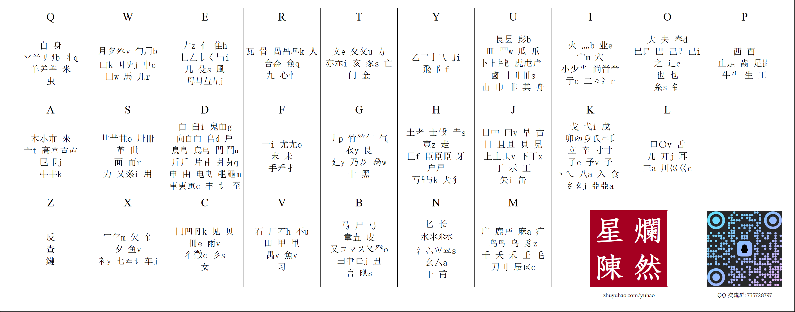
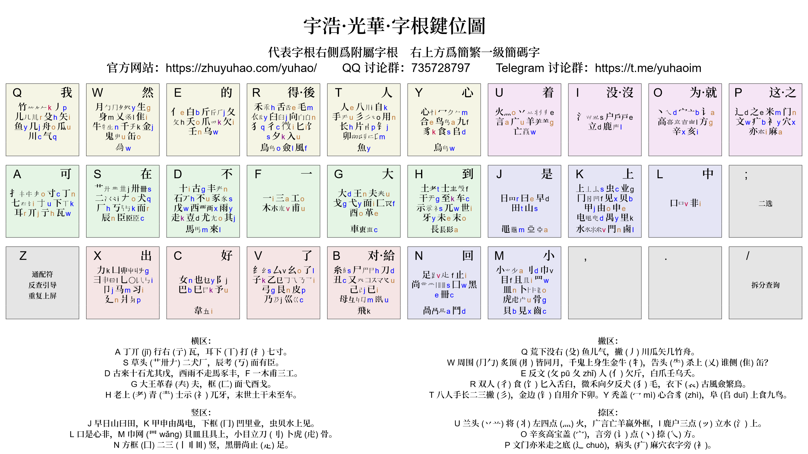
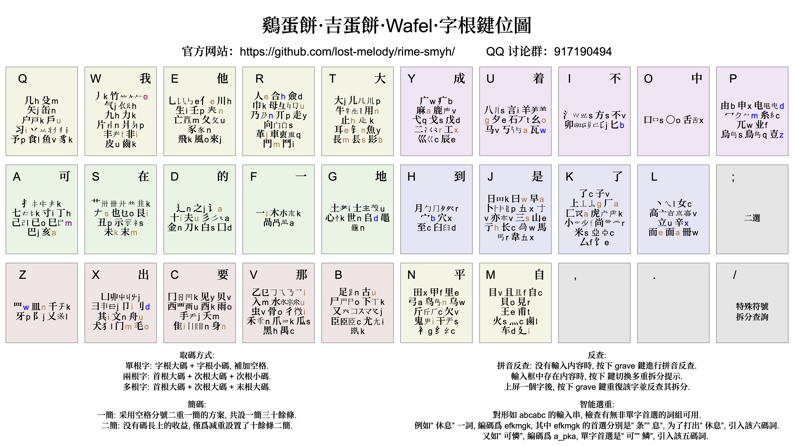

<!-- omit in toc -->
# 宇浩输入法
{: .no_toc }

  

    目录
  

  {: .text-delta }
1. TOC
{:toc}

{: .highlight }
>官方 QQ 群: [735728797](https://jq.qq.com/?_wv=1027&k=2OYDP4Tk) · 
>官方 TG 群: [yuhaoim](https://t.me/yuhaoim)  
>最新版本下载: [Github](https://github.com/forFudan/yuhao/releases/) · 
>[码云 Gitee](https://gitee.com/forFudan/yuhao/releases/) · 
>[永硕网盘](http://zhuyuhao.ysepan.com)  
<!-- >[快速入门](./docs/cookbook) ·  -->
>[详细教程和规则细节](./docs/learn) · 
>[Bilibili视频讲解](https://www.bilibili.com/video/BV1xw411E7ak/?spm_id_from=333.999.0.0&vd_source=10095df69b76db338d94ec79ead8f5bc)  
>在线练习小程序: 
>[**光華字根**](./docs/practice.html) ·
>[**星陳字根**](https://damon-kwok.github.io/yuhao/practice_star.html)  
>拆分及编码查询: 
>[**光華方案**](https://zhuyuhao.com/yuhao/light/chaifen/) ·
>[**星陳方案**](https://zhuyuhao.com/yuhao/star/chaifen/)  

<!-- {: .note }
>本页面介绍的是宇浩·光華，其他版本信息请移步导航栏 -->

## 致有缘人

当你点开这个页面的时候，你就是一名有缘人。

从第一次牙牙学语，到知道自己名字的写法，再到于洁白的信纸上写下洋洋洒洒的文章。这每一座人生的里程碑，都是一次同母语母文的邂逅和牵连。上下五千年，东西九万里，中国历史上，多少人曾穷经皓首、青灯红烛，在不同的载体上，写下一个又一个的汉字。只在那方寸之间，将灿烂的中华文明，传承了一代又一代。

你是否怀念初中时代的书桌前，用几种颜色的中性笔，书写着自己青春的悸动？你是否记得高中时代，你曾以笔为剑，书写着生活、对国家的思考？你是否想起，曾经一笔一划抄录过下唐诗宋词。那些波澜壮阔，抑或是清新隽永的诗句，至今还让你不时地想起而心潮澎湃？

如果你怀念这种一笔一划书写地感觉，那么，你来对了地方。

宇浩输入法，就是这样的一款输入法：他为了创作而设计，对汉字怀有一份脉脉的温情。不同于拼音输入法需要先输入读音，再选择想要的汉字，宇浩输入法将汉字的部首和笔画，安排在键盘的26个按键上。当你连续按下一个汉字中若干部首，这个汉字便会跳到屏幕上。在宇浩输入法中，每一个汉字，都基本对应着唯一的编码。因此在输入地过程中，你并不需要进行「选择汉字」这个操作。就像你在写字的时候，从不会停下来选择汉字。

用了它，你在打字中便不会经历恼人的停顿，在无尽的菜单栏中搜索想要的那个汉字；你可以如同在纸上书写一般打字，享受一种「下笔如有神」的自由感和「我书我所想」的掌控度。你甚至可以忽略输入框，享受闭眼创作的乐趣，自由书写古今汉字，在现代文、文言文之间随心徜徉。

文字不再是一匹匹无羁的野马，而是你指间缓缓流淌的旋律。

「确定带来自由」。如果你心动于这种体验，说明你是一个既浪漫又有品味的人，不妨加入我们吧！

## 基本特点

宇浩输入法是纯字形输入法，通过输入汉字的部首和笔画来输入汉字，而不依赖汉字的具体读音。也就是「会写就会打」「看到即输入」。这是如何做到的呢？答案是三个步骤：

- 第一步，也是宇浩输入法的核心：将每一个汉字拆成不超过四个部件（字根）。
- 第二步，是将这些部件转换成对应的英文字母。
- 第三步，将编码输入到电脑中，对应的汉字就会自动弹出来。

举个例子，「韵」这个字用宇浩输入法怎么输入呢？

- 第一步：将「韵」直观地拆成四个部件：立、日、勹、冫。
- 第二步：找到这四个部件对应的字母，分别是：K J W I。
- 第三步：将这四个字母输入到电脑中，「韵」这个字就会显示出来。

宇浩输入法具有以下的优点：

- 字频加权后的选重率极低，基本上一字一码，码到字出，极其适合盲打。
- 繁简字码位分离，比如<简><簡>不同编碼，繁体简体混在一起打也极少选重。
- 字形兼容大陆通规、[大陆古籍通规](./docs/articles/guji)[^guji_standards]、臺灣正體、香港繁体四套標準，方便检字。
- 设有简体、繁体两套词库，字形涵盖两岸三地三套标准[^opencc]。
- 全面覆盖 CJK 全字集 99000 多个汉字（更新至 CJK 扩 I 区），生僻字一网打尽。
- 检字方便，翻页少。总共 99000 多个汉字，候选项最多的码位上只有18个候选字。
- 采用大字根、拆法直观，不会将汉字拆得零碎。
- 字根为双编码，不分主副根，没有结构码。
- 拆分时取一、二、三、末字根。全简编码一致、字词编码一致。
- 拆字规范，规则优先级明确，兼顾「逻辑性」和「直观性」。追求一字一拆、无歧义。
- 兼顾手感，大码只使用25键。星陳方案双手互击率超过60%。

{: .highlight }
**繁简通打　动静低重　字根聚类　兼顾手感**

### 繁简通打
{: .no_toc }

绝大多数输入法，简体字和对应的繁体字都占用相同的码位，导致输入繁体时需要选重。比如五笔字型中，「簡」「简」两个字的编码都是`TUJf`。如果我想打繁体的「簡」，需要按一下选重键。因此，大多数输入法在繁体文本或繁简混合文本下，不具备盲打的优势。

宇浩输入法繁简汉字分离，不存在共用码位现象，故而繁简混合文本也不需要选重。你可以按照自己的喜好随时切换繁简状态，不需要软件转换，更不需要担心因为繁体字位于简体字的下方而需要选重。可以像写字一样随心切换任何字形。

比如，「简」「簡」这两个繁简汉字，在宇浩输入法中对应了不同的编码。这是因为宇浩输入法的「门」「門」字根繁简分离。在很多输入法中，由于繁简字根位于同一个按键，你需要从候选栏中选择繁体字还是简体字。

以下视频展示了使用宇浩单字全码输入**繁简混合**版本的《洛神赋》的片段节选。可以看到，全文都没有进行过选重。因此，宇浩输入法特别适合任意文本空间下的盲打，以及古汉语输入。



### 动静低重
{: .no_toc }

宇浩输入法支持繁简通打，并不代表它牺牲了**只打简体**或**只打繁体**的性能。我们不妨看一看下面的数据：

- 简体文本：常用 1500 字全码无重[^frequent_characters]。常用 3000 字，全码 10 组重码，出简后无重码。常用 4500 字，全码 55 组重码，出简后 2 组重码。**常用 6000 字，全码 117 组重码，出简后 14 组重码。字频加权后，全码下每万字选重 5 次。**

- 繁体文本：常用 1500 字，全码 1 组重码，出简后无重。常用 3000 字，全码 24 组重码，出简后 4 组重码。常用 4500 字，全码 92 组重码，出简后 13 组重码。常用 5700 字，全码 152 组重码，出简后 36 组重码。字频加权后，全码下每万字选重 15 次。

- 繁简混合文本[^mixed_frequency]：前 1500 字，全码 3 组重码，出简后无重。前 3000 字，全码 13 组重码，出简后 3 组重码。前 6000 字，全码 131 组重码，出简后 16 组重码。前 9000 字，全码 365 组重码，出简后 92 组重码。字频加权后，全码下每万字选重 17 次。

要知道，宇浩输入法只使用了25个按键，也就是说四码的编码空间只有其他26键输入法的85.5%。但是宇浩输入法在常用繁简汉字下选重率却是同类输入法中最低的。

### 均衡优异
{: .no_toc }

**繁简通打、动静低重、字根聚类、兼顾手感**，这是宇浩输入法的四个基本设计原则，目的在于避免机器学习中的「过拟合问题」，防止输入法被局限于特定的文本空间和字形状态，以期获得更大的适用性。在保证这四个原则的基础上，作者还采用了其他的客观指标作为算法的约束条件，以提高输入法的整体素质，防止有严重的短板产生。做到「整体性能均衡，部分指标优异」。总结如下：

- 单字重码表现优异，无论是全码还是简码，在简化字静重、简化字动重、繁体字动重、繁简混合动重方面都是最低。繁体字和大字集静重仅次于徐码。
- 双手互击表现突出，在字根分区的限制下，各连续文本双手互击率仅次于蓝宝石。
- 键位效率表现突出，没有使用 Z 键，不仅保证了一定的手感，还确保了输入平台的兼容性。
- 字形兼容表现优异，涵盖两岸三地四大标准字形（大陆简体、大陆繁体、台湾正体、香港繁体），词库也兼容了四套标准。真正做到打简体出简，打繁出繁。
- 词语重码表现均衡，各文本空间下选重率次于蓝宝石，和徐码相当，优于五笔。

关于作者设计本输入法时所使用的量化指标，请参见[以下章节](#优化算法所使用的指标)。

<!-- ## 适合人群

评价一款输入法，不能只看重码率，因为每一款输入法都有自己的**设计哲学**和**目标用户**。有优点就必然有缺点，反之亦然。评价一款输入法的维度，除却重码率，还有规则简易度、字根复杂度、按键舒适度、平台通用性等。这就是为什么拼音重码高，但大多数人还是会使用拼音，因为它的学习成本基本为零。选择学习输入法，一定要符合自己的需求，要综合考虑多方面因素，例如，是否愿意背较多的字根，是否有打古文、繁体字需求等。

宇浩输入法的最佳输入体验，是采用精简词库（80000词左右，同时包括简体、台湾繁体、香港繁体、大陆繁体）并配合单字输入，从而达到极致的确定性，做到完全关闭候选框输入。以下为宇浩输入法**最适合**的人群：

- 对繁体字和简化字都有输入需求，希望做到繁简无缝切换，不依赖程序进行转换的人（中文系学生、经常同两岸三地人士打交道者、方言爱好者、汉字爱好者等）；或
- 日常主要输入繁体文本的人（港澳台用户）；或
- 日常需要输入简体文本，偶尔需要输入繁体文本和生僻字的人；或
- 热爱汉字，喜欢一笔一画写字的感觉，想要学习传统汉字的人。 -->

## 聚类？分区？乱序？三码？

我们都有。

宇浩输入法的核心是对于汉字的拆分，其次是对于字根排布的设计。字根一共有 200 多个，但字母只有 26 个，因此，每个按键上都会有大约10个左右的字根。字根如何排布，直接决定了它的学习难度、维护难度、手感、连贯度等等。大体上：

- 对相似字形进行聚类和分区的方案，比乱序排布的方案，学习更加便捷，维护成本更低。比如：「目且貝見」这些都有「目」形的字根，如果安排在一个按键上，那么我们只要记住了其中的一个，就能立刻记住剩下的字根。
- 乱序排布的方案，比对相似字形进行聚类和分区的方案，手感更优。这是因为字根排布的设计中，最大的限制条件就是聚类。解除了这个限制，排布就更加自由，就能在手感上做到更好。
- 三码的方案，比四码的方案，思维负担更小。这是因为四码方案需要取到字的第三根，这个字根往往深入字的中部，思考起来需要更多时间。
- 四码的方案，比三码的方案，重码更低。这一点不言而喻。

每个人都有自己的偏好。为了照顾不同人群的需求。宇浩输入法有两套**官方字根排布设计**。同时，部分用户还发起并设计了其他的**衍生方案**。大家可根据自己的偏好和以前的输入习惯，选择其中一个学习。由于这些设计都基于「宇浩拆分」，因此就算后面想试试其他的设计，也只用几天就能适应。

### 宇浩·星陳

**宇浩·星陳**是官方字根排布设计，采用了字根聚类同键排布模式（类似郑码、徐码）。字形相似的字根会被聚拢在一道，排布在25个键位上。方案名取自《尚書大傳》之「明明上天，爛然星陳」。

由于大量字形相近的字根被放在了一个按键上，它对于初学者极为友好，可以通过联想记忆法，以「组」为单位来记忆。比如：

- 「目且貝見」和「日曰早」都在 J 上。
- 「亦文(夂)亥(豕)亡方」都在 T 上。

### 宇浩·光華

**宇浩·光華**是官方字根排布设计，采用了字根首笔分区排布模式（类似五笔、真码）。依据字根第一笔的笔画，分布在横竖撇捺折五区中。其中横区6键，竖区5键，撇区6键，捺区4键，折区4键。方案名取自《尚書大傳》之「日月光華，旦復旦兮」。

由于字根按照首笔笔画进行分区，适合有五笔经验的用户。

两个方案的区别，可参见以下表格。

| 特点                       | 宇浩·光華 | 宇浩·星陈 |
| :------------------------- | :-------- | :-------- |
| 使用最新版本**宇浩拆分**   | ✅         | ✅         |
| 支持到 CJK ext-I           | ✅         | ✅         |
| 兼容台湾字形拆分           | ✅         | ✅         |
| 繁简通打低极选重率 (<0.2%) | ✅         | ✅         |
| 字根双编码                 | ✅         | ✅         |
| 附属根比代表根多补一码     | ✅         | ❌         |
| 大码使用 Z 键              | ❌         | ❌         |
| 小码使用 Z 键              | ❌         | ✅         |
| 相似字形字根同分区聚类     | ✅         | ❌         |
| 相似字形字根同大码聚类     | ❌         | ✅         |
| 小码使用拼音中的字母       | ✅         | ✅         |
| 小码 >85% 使用拼音首字母   | ❌         | ✅         |
| 双手互击率 >60%            | ❌         | ✅         |
| 严格优化键位分布           | ❌         | ✅         |
| Z 键反查                   | ✅         | ✅         |

[宇浩输入法字根归并详表](https://github.com/forFudan/yuhao/releases/download/v3.0.0/default.pdf)列出部分易混淆字根的归并和录属关系。本表依据实际需求而更新。

### 吉旦饼

**吉旦饼**，是阿吉、王牌餅乾发起的一项衍生方案。它采用乱序字根设计、三码定长、延迟顶字。「吉旦饼」这个名字，来自三名主要开发人：阿吉，forFudan，王牌餅乾。取义于 華夫餅 (wafel)，其汉语翻译应有「鸡蛋饼」之义。

输入三码后，对应的三码单字不会上屏，而是将此汉字暂留在预选区，等到第七码的时候，才顶出第一字。每输入四码时，进入临时四码模式，可以选择 Tab 上屏对应的四码单字。因此可看作加强版的「五三顶」输入法。

鸡蛋饼不取第三字根，故而拆分起来更加简单，思维压力较小。

<!--  -->

项目地址：[https://lost-melody.github.io/wafel](https://lost-melody.github.io/wafel)

<!-- 
| 特点                       | 宇浩·星陈 | 吉旦饼                |
| :------------------------- | :-------- | :-------------------- |
| 使用最新版本**宇浩拆分**   | ✅         | ✅                     |
| 支持到 CJK ext-I           | ✅         | (四码模式下)          |
| 兼容台湾字形拆分           | ✅         | ❌                     |
| 字根双编码                 | ✅         | ✅                     |
| 三码方案                   | ❌         | ✅                     |
| 四码方案                   | ✅         | (支持四码加Tab键输入) |
| 单字派码长                 | ~3.15     | ~2.65                 |
| 一简二简个数               | ~600      | ~50                   |
| 繁简通打低极选重率 (<0.2%) | ✅         | (四码模式下)          |
| 大码使用 Z 键              | ❌         | ✅                     |
| 小码使用 Z 键              | ✅         | ✅                     |
| 相似字形字根同大码聚类     | ✅         | ❌                     |
| 小码使用拼音中的字母       | ✅         | ❌                     |
| 小码 >85% 使用拼音首字母   | ✅         | ❌                     |
| 双手互击率 >60%            | ✅         | ✅                     |
| 严格优化键位分布           | ✅         | ✅                     |
| Z 键反查                   | ✅         | ❌                     |
 -->

### 卿雲爛兮

[**卿雲爛兮**](https://zhuyuhao.com/yujoy)，是钱多多发起的一项衍生方案，特点是**乱序单编**，消灭对于小码的记忆。方案名取自《尚書大傳》之「卿雲爛兮，糺縵縵兮」。取码规则共两条：

1. 依次取第一、二、三、末字根对应的编码；
2. 不足四码时，输入一个补码，即末根读音。
<!-- 
所以，根据字根数量，有以下几种形式。设首根为 A，次根为 B，三根为 C，末根为 Z，读音为 p。

1. 单根字：Zp
2. 双根字：AZp
3. 三根字：ABZp
4. 多根字：ABCZ -->

本方案的**补码**，是末根的读音首字母，唯一的例外是高频「口」字根。

<!-- {: .highlight }
卿云取码歌诀  
一二三末取字根　单根成字即自身  
双根便作首和末　三根首二同末存  
字根表中找编码　二十五键莫看岔  
依次填入根字母　不足四码加补码  
补码就是末根音　以下法则心里记  
鱼化ｖ来衣作ｉ　口补ｖ外无特例  

| 末根补码 | 规则                    | 举例                    |
| :------- | :---------------------- | ----------------------- |
| v        | 频率最高的字根，补码为v | 口                      |
| v        | 读音为 ㄩ 的，补码为 v  | 鱼魚雨禺予 月曰         |
| i        | 读音为 ㄧ 的，补码为 i  | 一乙已乂弋亦衤 言羊用夭 |

字根是有限的，因此本方案依旧是纯形方案，不是形音方案。 -->

本方案**繁简通打**，其关键数据如下：

- 简体动态选重率 0.08%
- 繁体动态选重率 0.08%
- 繁简混合动态选重率 0.135%
- 全码速度当量 1.27，简码速度当量 1.28
- 单字平均双手互击率 > 65%，连续文本双手互击率 > 45%

以下为本方案的字根图。可能作为末根的生僻部首，图上标注其读音，以供参考：

## 数据对比

关于本输入法的相关指标的定义、数据统计、同类型输入法对比，可参见文章[《常见输入法重码数据》](./docs/articles/statistics)。

## 开发细节

关于本输入法的算法、指标、代码实现，可参见文章[《宇浩输入法开发技术文档》](./docs/technical)。

{: .note }
宇浩方案的哲学是：**实用**、**直观**、**科学**、**理性**。实用，指的是完全以输入而非检字进行设计；直观，指的是对汉字的拆分直观易懂，不破坏汉字的美感；科学，指的是对于编码和简码的设计科学合理，符合统计频率，使用量化指标而非感性体验；理性，指的是拆字规则逻辑严明、没有二义，也指社群抱着理性和开放的态度去面对批评和建议，积极修正存在矛盾的、不正确的拆分。

## 鸣谢

本输入法的设计制作主要借鉴了三个前辈输入法的优点，在这里向他们的作者表示极大的敬意和感谢。它们包括：

- 郑码的大字根、双编码设计。通过「位码」而非「结构码」来挖掘首根的信息。
- 徐码对于繁简通打的支持，以及小码从拼音字母中选取的特点。使用音托不仅方便记忆，也可以达到更佳的离散。
- 五笔字型字根分区排布、不使用 Z 键的特征。分区排布方便对于字根的记忆，Z 键空出后利于手感，还能用于其他功能，方便各平台通用。

在输入法的制作过程中，不少伙伴提出了大量宝贵的意见和建议，帮助它不断优化进步。特此致以极大的谢意。

- 钱多多为输入法的推广作出大量的努力。还绘制了黑体的字根图、设计了输入法的 Logo 和 Android 上的定制方案。可谓「首席艺术委员」。
- 阿吉始终鼓励作者开发一款新的输入法，他的很多观点和设计哲学同作者不谋而合，也坚定了宇浩输入法讲客观、讲实用的理念。他为输入法的字根规律性和易学性提出了大量建议，使折区字根的排布上了一个台阶。可谓「首席哲学委员」。
- 宋天为输入法的规则的完善提出了大量意见和建议，找出了很多拆分上的不合理之处，尤其是在大字集的拆分上，他的建议至关重要，也使宇浩输入法在常用字集内拆分无二义、规则无矛盾。可谓「首席拆分委员」。
- 王牌饼干不仅设计了非常好用的「宇浩三码顶」方案，还为 RIME 方案编写了优秀的 Lua 代码。可谓「首席技术委员」。

还有不少朋友为输入法的优化提出了宝贵的意见和建议，此处不一一致谢。

有联为证：

{: .highlight }
>汉字十万，岂宇浩独收八九？  
>字根两百，因诸君而改二三。

## 脚注

[^frequent_characters]: 「最常用汉字」的定义依赖于文本空间。关于本测评中所用的字频数据的来源，[请参阅此页面](./docs/articles/statistics)。

[^guji_standards]: 中华人民共和国国家标准《古籍印刷通用字规范字形表》（GB/Z 40637-2021）：[https://openstd.samr.gov.cn/bzgk/gb/newGbInfo?hcno=52E2DE28D439C1937EE09AE4B5AA615B](https://openstd.samr.gov.cn/bzgk/gb/newGbInfo?hcno=52E2DE28D439C1937EE09AE4B5AA615B)

[^mixed_frequency]: 这里的繁简混合字频来源于简体字频和繁体字频。假设一个人一半时间打简体，一半时间打繁体，那么便适用于此数据。

[^opencc]: 两岸三地三套标准包括：大陆简体、大陆繁體、臺灣正體。另外，宇浩输入法还兼容符合 OpenCC 用字标准的词语。
